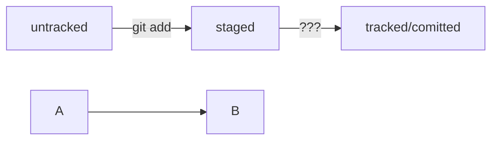

# Установка

Перейти на страницу официального сайта [Git](https://git-scm.com/download/win "Перейти на сайт 
загрузки").
Скачать одну из двух версий из категории Standalone Installer (англ. «автономный установщик»). Узнать 
тип системы Windows можно в настройках.
Запустить программу установки. Обратить внимание, куда будет установлен Git. По умолчанию C:\Program 
Files\Git.
Проверить, что в списке устанавливаемых программ стоит галочка напротив пункта Git Bash Here — это 
позволит открывать консоль с Git в любой папке.
Далее установщик предложит много опций. Достаточно оставить все настройки по умолчанию. Несколько раз 
нажать Next (англ. «далее»), пока не начнётся процесс установки.
После окончания установки нажать Finish (англ. «завершить»).

# Первый запуск Git Bash

Запустить программу Git Bash можно двумя способами: ввести название программы в окно поиска на панели 
задач или открыть директорию, в которую был установлен Git - по умолчанию C:\Program Files\Git\bin и 
запустить файл bash.exe.
Откроется консоль, в которой будет написано имя_пользователя@имя_компьютера, ниже $ |

# Комманды консоли

## Навигация

| Команда			| Назначение								|  Перевод					|
|-------------------|:------------------------------------------|:--------------------------|
|pwd 				| показать рабочую папку 					| print working directory	|
|ls 				| отобразить содержимое директории 			| list directory contents	|
|ls -a 				| отобразить также скрытые файлы и папки, 	|							|
|					|названия которых начинаются с символа . 	|							|
|cd project 		| сменить директорию / перейди в project 	| change directory			|
|cd project/html 	| перейди в папку html, которая находится в |							|
|					|папке project 								|							|
|cd .. 				| перейди выше, в родительскую папку		|							|
|cd ~ 				| перейди в домашнюю папку (/Users/Username)|							|
|cd / 				| перейди в корневую директорию.			|							|

## Работа с файлами и папками. Создание

| Команда			| Назначение								|  Перевод					|
|-------------------|:------------------------------------------|:--------------------------|
|touch index.html 	| создай файл index.html в текущей папке 	| touch - «коснуться») 		|
|mkdir project		| создать директорию/папку с именем project | make directory			|
|					|в текущей папке 							| make directory			|


>touch index.html style.css script.js - если нужно создать сразу несколько файлов, можно напечатать их 
имена в одну строку через пробел

## Копирование и перемещение

|Команда			| Назначение								|  Перевод					|
|-------------------|:------------------------------------------|:--------------------------|
|cp file.txt ~/dir	| копировать файл в другое место 			| copy						|
|mv file.txt ~/dir 	| перемести файл или папку в другое место 	| move						|

## Чтение

|Команда			| Назначение								|  Перевод					|
|-------------------|:------------------------------------------|:--------------------------|
|cat file.txt 		| объединить и распечатать содержимое 		|							|
|					|текстового файла file.txt 					| concatenate and print		|

## Удаление

|Команда			| Назначение								|  Перевод					|
|-------------------|:------------------------------------------|:--------------------------|
|rm about.html 		| удалить файл about.html 					| remove					|
|rmdir images  		| удалить директорию/папку images 			| remove directory			|
|rm -r project 		| удалить папку project и всё содержимое	| remove					|

### Полезные возможности

> Команды необязательно печатать и выполнять по очереди. Можно указать их списком — разделить двумя 
амперсандами (&&).
У консоли есть собственная память — буфер с несколькими последними командами. По ним можно перемещаться
с помощью клавиш со стрелками вверх (↑) и вниз (↓).
Чтобы не вводить название файла или папки полностью, можно набрать первые символы имени и дважды нажать
Tab. Если файл или папка есть в текущей директории, командная строка допишет путь сама.
Например, вы находитесь в папке dev. Начните вводить cd first и дважды нажмите Tab. Если папка 
first-project есть внутри dev, командная строка автоматически подставит её имя. Останется только нажать
Enter.

git version - узнать версию установленной Git 
git config --global user.name "UserName" - имя или ник нужно написать латиницей и в кавычках 
git config --global user.email username@mail.com - здесь нужно указать свой настоящий email 
$ git config --global user.name "UserName" 
$ git config --global user.email "UserName@mail.com" 
cat ~/.gitconfig - Все глобальные настройки Git хранит в файле .gitconfig в домашней директории. 
Команда запишет в этот файл указанные имя и почту. Чтобы убедиться в этом, можно вызвать команду для 
чтения файлов. 
git config --list

Сделать папку репозиторием — git init 
Чтобы Git начал отслеживать изменения в проекте, папку с файлами этого проекта нужно сделать 
Git-репозиторием (от англ. repository — «хранилище»). Для этого следует переместиться в неё и ввести 
команду git init (от англ. initialize — «инициализировать»). 

```BASH
cd ~/dev/first-project # перешли в нужную папку 
git init # создали репозиторий 
```

«Разгитить» папку, если что-то пошло не так, — rm -rf .git 
Если вы случайно сделали Git-репозиторием не ту папку, её можно «разгитить». Для этого нужно удалить 
скрытую подпапку .git. 

```BASH
$ cd <папка с репозиторием> # перешли в папку 

$ rm -rf .git # удалили подпапку .git 
```

Проверить состояние репозитория — git status 
git status 

Подготовить файлы к сохранению — git add 

```BASH
$ touch todo.txt 
$ touch readme.txt 
```

создали файлы todo.txt и readme.txt 

```BASH
$ git status # проверили статус 
$ git add todo.txt 
$ git add readme.txt 
$ git add --all # подготовили к сохранению все файлы в репозитории 
```

Выполнить коммит — git commit 
Сделать коммит можно командой git commit c ключом -m (от англ. message — «сообщение»), который 
присваивает коммиту сообщение. 

git commit -m ‘Мой первый коммит!’  

Просмотреть историю коммитов — git log 

## Инструкция по регистрации на GitHub

В правом верхнем углу главной страницы [GitHub](https://github.com/ "Главная страница GitHub") нажмите 
на Sign up (англ. «зарегистрироваться»).

На экране будут последовательно появляться поля для ввода.
2.1. Введите адрес электронной почты (англ. Enter your email). 
2.2. Придумайте пароль (англ. Create a password). 
2.3. Введите имя пользователя (англ. Enter a username). 

Платформа спросит, хотите ли вы получать на почту рассылку с обновлениями и новостями (англ. Would you 
like to receive product updates and announcements via email?). Введите y, если хотите получать 
рассылку, или n, если не хотите.
Нажмите кнопку Continue (англ. «продолжить»).

GitHub предложит вам пройти капчу. Сделайте это.
После прохождения капчи нажмите Create account (англ. «создать аккаунт»).
Введите короткий код, который будет отправлен на указанный вами почтовый адрес.

Поздравляем! Вы успешно зарегистрировались на крупнейшем веб-хостинге проектов GitHub. Теперь у вас 
есть возможность работать бок о бок с миллионами профессионалов по всему миру, обмениваться идеями и 
развиваться. 

## Инструкция по созданию репозитория на GitHub

Зайдите в свой профиль по ссылке https://github.com/username, где username — имя, которое вы указали 
при регистрации.

Эта страница — презентация вас и ваших проектов. Её видят другие пользователи. Надпись You don't have 
any public repositories yet (англ. «у вас пока нет публичных репозиториев») сообщает, что пока у вас 
нет проектов.

Создайте репозиторий. Для этого перейдите на вкладку Repositories (англ. «репозитории»), а затем 
нажмите на зелёную кнопку New (англ. «новый») справа.

Открылось окно создания нового репозитория. Назовите его first-project. Название удалённого репозитория
необязательно должно совпадать с именем папки проекта у вас на компьютере. Но чтобы не путаться, будем
называть их одинаково.

Другие поля вам пока не понадобятся. Смело нажимайте на зелёную кнопку Create repository (англ. 
«создать репозиторий») внизу.

Готово! Удалённый репозиторий создан. Страница с ним открывается автоматически. 

Осталось связать удалённый репозиторий с локальным, который уже есть на вашем компьютере. GitHub 
предоставляет для этого инструкцию (пункт …or push an existing repository from the command line).
Но прежде, чтобы упростить работу с GitHub и сделать её более безопасной, вы научитесь генерировать 
SSH-ключи (от англ. Secure Shell — «безопасная оболочка»)

## Генерируем SSH-ключ

```
Представьте, что у вас есть ключ от двери, за которой хранится важный документ. Чтобы получить доступ 
к этому документу, вам нужно вставить ключ в замочную скважину и повернуть его. Поскольку ключ есть 
только у вас, ваш документ надёжно защищён от посторонних глаз. Чтобы получить доступ к репозиторию на 
GitHub, вам тоже нужно предоставить ключ, который подтверждает вашу личность и права на чтение или 
изменение данных. Без этого ключа доступ будет ограничен. Об этом и пойдёт речь в уроке.
```

## Что такое SSH

Когда компьютеры обмениваются данными в сети, они следуют сетевым протоколам (англ. network protocols) 
— правилам обмена данными между компьютерами.
Один из наиболее распространённых сетевых протоколов — SSH (от англ. Secure Shell Protocol). Он 
обеспечивает безопасный обмен данными в сети. С помощью этого протокола можно получать данные с 
удалённого компьютера или отправлять их на него. Трафик шифруется, поэтому протокол безопасен.
SSH использует пару ключей для обеспечения безопасности — публичный и приватный: 

Приватный ключ (англ. private key) хранится только на вашем компьютере и не должен передаваться 
кому-либо ещё. Он используется для расшифровки данных.

Публичный ключ (англ. public key) доступен всем и используется для шифрования данных.
Они могут быть расшифрованы парным приватным ключом.
Только вы можете расшифровать данные с помощью приватного ключа, но любой владелец публичного ключа 
может их для вас зашифровать.
Эти два ключа связаны и образуют SSH-пару. В будущем вы наверняка будете использовать их для 
взаимодействия с GitHub и другими
удалёнными серверами.

## Создание ключа шифрования SHH

Проверка наличия SSH-ключа
 cd ~ перейти в домашнюю директорию
 ls -la .ssh/ вывели список созданных ключей

## Инструкция по генерации SSH-ключа

Для генерации SSH-пары можно использовать программу ssh-keygen. Откройте терминал и введите следующую 
команду.
ssh-keygen -t ed25519 -C "User@mail.com" - электронная почта, к которой привязан ваш аккаунт на GitHub"
 
Generating public/private rsa key pair. - сгенерированы публичный и приватный ключи
Укажите место хранения ключей. Простой вариант — сделать домашний каталог пользователя путём по 
умолчанию. Для этого нажмите Enter.

Enter passphrase (empty for no passphrase): [Type a passphrase]
Enter same passphrase again: [Type passphrase again] 
Программа запросит кодовую фразу (англ. passphrase) для доступа к SSH-ключу. Вы можете оставить поле 
пустым. Для этого нажмите Enter, а затем ещё раз Enter для подтверждения.
```BASH
Enter passphrase (empty for no passphrase):
Enter same passphrase again:
Your identification has been saved in /c/Users/UserName/.ssh/id_ed25519
Your public key has been saved in /c/Users/UserName/.ssh/id_ed25519.pub
The key fingerprint is:
SHA256:u+jW2SUszanEX/1BdH0cr0PDOQYSfCZ3F0CMW2+D6dM UserName@mail.com
The key's randomart image is:
+--[ED25519 256]--+
|         .o.=o.++|
|          oo+=.oB|
|           =o.%.+|
|           . = O |
|       .S+ ...* .|
|        +.* oo.E |
|       o.* +  ...|
|      ..+.o     .|
|     oo .        |
+----[SHA256]-----+

ls -a ~/.ssh 
```

## Инструкция по связыванию SSH-ключа и GitHub-аккаунта

В директории ~/.ssh будет создано два файла — id_ed25519 и id_ed25519.pub (или id_rsa и id_rsa.pub — в 
зависимости от выбранного алгоритма шифрования):
id_ed25519/id_rsa — приватный ключ (файл без .pub в конце). Ни в коем случае не копируйте его и не 
делитесь им.
id_ed25519.pub/id_rsa.pub — публичный ключ (на это указывает расширение .pub).
Скопируйте содержимое файла с публичным ключом в буфер обмена.

## для macOS
скопировать содержимое ключа в буфер обмена:
```
$ pbcopy < ~/.ssh/id_rsa.pub
для ed25519:
$ pbcopy < ~/.ssh/id_ed25519.pub 
Здесь используется команда pbcopy — она копирует поток данных в буфер обмена. 
Запись pbcopy < ~/.ssh/id_rsa.pub означает: «Скопируй в буфер обмена всё 
содержимое файла ~/.ssh/id_rsa.pub».
```
В качестве альтернативы вы можете распечатать файл на экран с помощью cat ~/.ssh/id_rsa.pub и 
скопировать его вручную.

## для Windows
скопировать содержимое ключа в буфер обмена:

```BASH
$ clip < ~/.ssh/id_rsa.pub
для ed25519:
$ clip < ~/.ssh/id_ed25519.pub 
Если clip не сработает, выведите содержимое файла с помощью 
cat ~/.ssh/id_rsa.pub или cat ~/.ssh/id_ed25519.pub и 
скопируйте вывод в буфер обмена из консоли.
```
Перейдите на GitHub и выберите пункт Settings (англ. «настройки») в меню аккаунта.

В меню слева нажмите на пункт SSH and GPG keys.

В открывшейся вкладке выберите New SSH key (англ. «новый SSH-ключ»).

В поле Title (англ. «заголовок») напишите название ключа. Например, Personal key (англ. «личный ключ»).
В поле Key type (англ. «тип ключа») должно быть Authentication Key (англ. «ключ аутентификации»).
В поле Key скопируйте ваш ключ из буфера обмена.


8. Нажмите на кнопку Add SSH key (англ. «добавить SSH-ключ»).

Проверьте правильность ключа с помощью следующей команды.
$ ssh -T git@github.com 
Если это первый раз, когда вы используете Git, чтобы поделиться проектом на GitHub, появится похожее 
предупреждение.
The authenticity of host 'github.com (140.82.121.4)' can't be established. ED25519 key fingerprint is 
SHA256:+DiY3wvvV6TuJJhbpZisF/zLDA0zPMSvHdkr4UvCOqU. This key is not known by any other names. Are you 
sure you want to continue connecting (yes/no/[fingerprint])? 
Это предупреждение сообщает, что вы никогда не соединялись с сервером GitHub. Поэтому Git не может 
гарантировать, что сервер является тем, за кого он себя выдаёт.
Для подтверждения подлинности сервер генерирует и публикует ключи SHA256. Вы можете проверить ключи 
GitHub по этой ссылке. Если ключ в предупреждении совпадает с тем, что вы видите на сайте, значит, 
сервер является действительным. Введите yes, чтобы продолжить. Вы увидите приветствие на экране.
Hi %ВАШ_АККАУНТ%! You've successfully authenticated, but GitHub does not provide shell access. 
Если у вас возникли сложности при генерации или привязке SSH-ключей, посмотрите видеоинструкцию, в 
которой мы показываем всё по порядку.

## Привязать удалённый репозиторий к локальному — git remote add

Перейдите на страницу удалённого репозитория, выберите тип SSH и скопируйте URL. Кнопка справа позволит
сделать это мгновенно.
git@github.com:UserName/project.git
git remote add origin git@github.com:UserName/project.git

В командную строку нельзя вставить текст из буфера обмена с помощью привычного сочетания Ctrl+V. На 
Windows (в Git Bash) и Linux для этого используется сочетание Ctrl+Shift+V, а на macOS — Cmd+V.
Также можно нажать правую кнопку мыши и выбрать пункт Paste (англ. «вставить») в выпадающем меню.
origin (англ. «источник») — стандартный псевдоним, с помощью которого можно обращаться к главному 
удалённому репозиторию (обычно такой репозиторий один). Это значительно упрощает работу.

Убедиться, что репозитории связаны, — git remote -v
git remote -v
origin git@github.com:UserName/project. (fetch)
origin git@github.com:UserName/project. (push)

В выводе вы должны увидеть две строчки, аналогичные тем, что показаны выше.
Флаг -v — короткая форма флага --verbose (англ. «подробный»). Он позволяет показать больше информации в
выводе.

Отправить изменения на удалённый репозиторий — git push

В первый раз эту команду нужно вызвать с флагом -u и параметрами origin (имя удалённого репозитория) и 
main или master (название текущей ветки). Флаг -u свяжет локальную ветку с одноимённой удалённой. Как 
вы связывали локальный и удалённый репозитории в предыдущем уроке, так же и здесь нужно дополнительно 
связать ветки.

git config --list
$ git config --list
diff.astextplain.textconv=astextplain
filter.lfs.clean=git-lfs clean -- %f
filter.lfs.smudge=git-lfs smudge -- %f
filter.lfs.process=git-lfs filter-process
filter.lfs.required=true
http.sslbackend=openssl
http.sslcainfo=C:/Program Files/Git/mingw64/etc/ssl/certs/ca-bundle.crt
core.autocrlf=true
core.fscache=true
core.symlinks=false
pull.rebase=false
credential.helper=manager
credential.https://dev.azure.com.usehttppath=true
init.defaultbranch=master
user.name=UserName
user.email=UserName@mail.com
core.repositoryformatversion=0
core.filemode=false
core.bare=false
core.logallrefupdates=true
core.symlinks=false
core.ignorecase=true
remote.origin.url=git@github.com:UserName/project.git
remote.origin.fetch=+refs/heads/*:refs/remotes/origin/*

git push -u origin master

$ git push -u origin master
Enumerating objects: 14, done.
Counting objects: 100% (14/14), done.
Delta compression using up to 20 threads
Compressing objects: 100% (10/10), done.
Writing objects: 100% (14/14), 1.27 KiB | 1.27 MiB/s, done.
Total 14 (delta 1), reused 0 (delta 0), pack-reused 0
remote: Resolving deltas: 100% (1/1), done.
To github.com:UserName/project.git
 * [new branch]      master -> master
branch 'master' set up to track 'origin/master'.

В дальнейшем при работе с удалённым репозиторием флаг -u можно опустить и писать просто git push.

Преимущество README.md в том, что средства командной работы (такие, как GitHub) могут отображать его 
содержимое в браузере в виде удобной разметки. Для этого нужно не просто залить текст, но и настроить 
шрифт, заголовки и отступы с помощью markdown. Маркда́ун — это специальный язык разметки. Он позволяет 
красиво отформатировать текстовый документ.

# Шпаргалка markdown

## Выделение текста

Вы можете выделять текст в markdown с помощью символов `_` или `*`. Например:

Пример _курсива_ и **жирного** текста.

## Заголовки

Заголовки можно создавать с помощью символа `#`. Чем больше `#`, тем меньше заголовок. Например:

# Заголовок первого уровня
## Заголовок второго уровня
### Заголовок третьего уровня

## Выделение кода

Чтобы выделить текст как код, поместите его в тройные кавычки "`". 

```
mkdir my_project
cd my_project
git init
```

Это лишь некоторые функции markdown. 

## Ссылки

Чтобы сделать ссылкой часть текста, его заключают в квадратные скобки, а затем указывают нужный адрес 
в круглых скобках.
[Яндекс](https://www.yandex.ru) 
Также можно добавить ссылке тайтл (от англ title — «название», «заголовок»). Тайтл — это всплывающая 
подсказка, которая появляется при наведении мыши на ссылку. Тайтл нужно заключить в кавычки и указать 
внутри скобок после адреса. [Яндекс](https://www.yandex.ru "Я Yandex!") 


# Хеш — идентификатор коммита

Что такое хеш. Хеширование коммитов
Хеширование (от англ. hash, «рубить», «крошить», «мешанина») — это способ преобразовать набор данных и 
получить их «отпечаток» (англ. fingerprint).
Информация о коммите — это набор данных: когда был сделан коммит, содержимое файлов в репозитории на 
момент коммита и ссылка на предыдущий, или родительский (англ. parent), коммит.
Git хеширует (преобразует) информацию о коммите с помощью алгоритма SHA-1 (от англ. Secure Hash 
Algorithm — «безопасный алгоритм хеширования») и получает для каждого коммита свой уникальный хеш — 
результат хеширования.

Обычно хеш — это короткая (40 символов в случае SHA-1) строка, которая состоит из цифр 0—9 и латинских 
букв A—F (неважно, заглавных или строчных). Она обладает следующими важными свойствами:
если хеш получить дважды для одного и того же набора входных данных, то результат будет гарантированно 
одинаковый;
если хоть что-то в исходных данных поменяется (хотя бы один символ), то хеш тоже изменится (причём 
сильно).
Поэкспериментировать с SHA-1 можно на [сайте](https://emn178.github.io/online-tools/sha1.html) — 
попробуйте ввести в поле input (англ. «ввод») разные символы, слова или предложения и понаблюдайте, как
 меняется хеш в поле output (англ. «вывод»).

Хеш — основной идентификатор коммита
Git хранит таблицу соответствий хеш → информация о коммите. Если вы знаете хеш, вы можете узнать всё 
остальное: автора и дату коммита и содержимое закоммиченных файлов. Можно сказать, что хеш — основной 
идентификатор коммита.
При работе с Git хеши будут встречаться регулярно. Их можно будет передавать в качестве параметра 
разным Git-командам, чтобы указать, с каким коммитом нужно произвести то или иное действие.
Все хеши и таблицу хеш → информация о коммите Git сохраняет в служебные файлы. Они находятся в скрытой 
папке .git в репозитории проекта.

# Лог

Лог (от англ. log — «журнал записей»). Сокращённый лог полезен, если нужно быстро найти нужный коммит 
среди сотни других.
git log

Элементы описания коммита
После вызова git log появляется список коммитов.

строка из цифр и латинских букв после слова commit — это хеш коммита;
Author — имя автора и его электронная почта;
Date — дата и время создания коммита;
в конце находится сообщение коммита.

Получить сокращённый лог — git log --oneline
Получить сокращённый лог можно с помощью команды git log с флагом --oneline (англ. «одной строкой»). В 
терминале появятся только первые несколько символов хеша каждого коммита и их комментарии.

Сокращённый лог полезен, если в репозитории уже много коммитов — например, сотни или тысячи. В этом 
случае можно быстро найти нужный по описанию.
Сокращённый хеш (то есть первые несколько символов полного) можно использовать точно так же, как и 
полный. Для этого команда git log --oneline автоматически подбирает такую длину сокращённых хешей, 
чтобы они были уникальными в пределах репозитория и Git всегда мог понять, о каком коммите идёт речь.

```
Обратите внимание: если выход из просмотра логов не произошёл автоматически, нажмите клавишу Q (от 
англ. Quit — «выйти») в английской раскладке клавиатуры.
```

# HEAD — всему голова

При вызове команды git log вы также могли заметить надпись (HEAD -> master) после хеша одного из 
коммитов. В этом уроке расскажем, что она означает.

Файл HEAD
Файл HEAD (англ. «голова», «головной») — один из служебных файлов папки .git. Он указывает на коммит, 
который сделан последним (то есть на самый новый).
В этом можно убедиться с помощью терминала. Перейдите в папку .git командой cd. Посмотрите содержимое 
файла HEAD командой cat.

```bash
$ pwd # посмотрели, где мы
/Users/user/dev/first-project

$ cd .git/
$ ls # посмотрели, какие есть файлы
COMMIT_EDITMSG  ORIG_HEAD  description  index  logs/     refs/
HEAD            config     hooks/       info/  objects/

$ cat HEAD # команда cat показывает содержимое файла
ref: refs/heads/master # в файле вот такая ссылка 
Внутри HEAD — ссылка на служебный файл: refs/heads/master (или refs/heads/main в зависимости от 
названия ветки). Если заглянуть в этот файл, можно увидеть хеш последнего коммита.
$ cat refs/heads/master # взяли ссылку из файла HEAD

внутри хеш
e007f5035f113f9abca78fe2149c593959da5eb7

$ git log 
сверяем с хешем последнего коммита
commit e007f5035f113f9abca78fe2149c593959da5eb7
Author: John Doe <johndoe@example.com>
Date:   Tue Mar 28 00:26:53 2023 +0300

    Добавить амбиций в список дел
```
... # другие коммиты 
Когда вы делаете коммит, Git обновляет refs/heads/master — записывает в него хеш последнего коммита. 
Получается, что HEAD тоже обновляется, так как ссылается на refs/heads/master.
При работе с Git указатель HEAD используется довольно часто. Мы уже упоминали, что многие команды Git 
принимают в качестве параметра хеш коммита. Если нужно передать последний коммит, то вместо его хеша 
можно просто написать слово HEAD — Git поймёт, что вы имели в виду последний коммит.

# Статусы файлов в Git

До появления Git системы контроля версий выделяли только два статуса у файлов: «уже закоммичен» и «ещё 
не закоммичен». Например, в Subversion (самой популярной VCS до эпохи Git) не нужно было выполнять 
команду — аналог git add, а можно было просто сделать коммит (svn commit). Эта команда по умолчанию 
добавляла в коммит все новые и изменённые файлы.

Такое поведение интуитивно более понятно. Зато Git даёт больше контроля за состоянием файлов. Хотя 
сначала это может показаться сложным, со временем вы оцените удобство более явного подхода.

Разберём подробнее, в каких состояниях (или статусах) могут находиться файлы в репозитории. А ещё 
проследим типичный жизненный цикл файла в Git.

## Статусы untracked/tracked, staged и modified

Одна из ключевых задач Git — отслеживать изменения файлов в репозитории. Для этого каждый файл 
помечается каким-либо статусом. Рассмотрим основные.

### untracked (англ. «неотслеживаемый»)

Мы говорили, что новые файлы в Git-репозитории помечаются как untracked, то есть неотслеживаемые. Git 
«видит», что такой файл существует, но не следит за изменениями в нём. У untracked-файла нет предыдущих
версий, зафиксированных в коммитах или через команду git add.

### staged (англ. «подготовленный»)
  
После выполнения команды git add файл попадает в staging area (от англ. stage — «сцена», «этап 
[процесса]» и area — «область»), то есть в список файлов, которые войдут в коммит. В этот момент файл 
находится в состоянии staged.

В одном из предыдущих уроков мы сравнили коммит с фотографией. Можно развить эту аналогию и сказать, 
что команда git add добавляет персонажей (текущее содержимое файла или нескольких файлов) на сцену 
(англ. stage) для общей фотографии, а git commit делает снимок всей сцены целиком. 

```
Staging area, index и cache

Staging area также называют index (англ. «каталог») или cache (англ. «кеш»), а состояние файла staged 
иногда называют indexed или cached.
Все три варианта могут встречаться в документации и в качестве флагов команд Git. А также в интернете 
— например, в вопросах и ответах на сайте Stack Overflow.
```

### tracked (англ. «отслеживаемый»)

Состояние tracked — это противоположность untracked. Оно довольно широкое по смыслу: в него попадают 
файлы, которые уже были зафиксированы с помощью git commit, а также файлы, которые были добавлены в 
staging area командой git add. То есть все файлы, в которых Git так или иначе отслеживает изменения.

### modified (англ. «изменённый»)

Состояние modified означает, что Git сравнил содержимое файла с последней сохранённой версией и нашёл 
отличия. Например, файл был закоммичен и после этого изменён.

```
Для файлов в состояниях staged и modified обычно не указывают, что они также tracked, потому что это 
состояние подразумевается.
```

## Про staged и modified

Команда git add добавляет в staging area только текущее содержимое файла. Если вы, например, сделаете 
git add file.txt, а затем измените file.txt, то новое содержимое файла не будет находиться в staging.
Git сообщит об этом с помощью статуса modified: файл изменён относительно той версии, которая уже в 
staging. Чтобы добавить в staging последнюю версию, нужно выполнить git add file.txt ещё раз.

## Типичный жизненный цикл файла в Git

Может показаться, что файлы в репозитории попадают в разные состояния хаотично. На практике это не так,
и у большинства файлов вполне предсказуемый путь.


1. Файл только что создали. Git ещё не отслеживает содержимое этого файла. Состояние: untracked.
2. Файл добавили в staging area с помощью git add. Состояние: staged (+ tracked).
2.1. Возможно, изменили файл ещё раз. Состояния: staged, modified (+ tracked).
2.2. Обратите внимание: staged и modified у одного файла, но у разных его версий.
2.3. Ещё раз выполнили git add. Состояние: staged (+ tracked).
3. Сделали коммит с помощью git commit. Состояние: tracked.
4. Изменили файл. Состояние: modified (+ tracked).
5. Снова добавили в staging area с помощью git add. Состояния: staged (+ tracked).
6. Сделали коммит. Состояния: tracked.
Повторили пункты 4−7 много-много раз.

Выглядит довольно запутанно! Но на практике разобраться с этим будет проще, чем кажется.

# Как читать git status

Частая ошибка при использовании Git — закоммитить лишнее или, наоборот, забыть добавить важный файл в 
коммит. Этого легко избежать, если не забывать проверять статусы файлов с помощью команды git status. 
Как читать её вывод, покажем в этом уроке.

## Какие состояния показывает git status

Большинство файлов в типичном проекте будут находиться в состоянии tracked (то есть закоммичены и не 
изменены после коммита). Вы не увидите это состояние в выводе команды git status — иначе она бы каждый 
раз выводила список вообще всех файлов проекта.

В итоге git status показывает только следующие состояния файлов:
 - staged (Changes to be committed в выводе git status);
 - modified (Changes not staged for commit);
 - untracked (Untracked files).
 


## Подготавливаем репозиторий

Чтобы попрактиковаться, инициализируйте новый репозиторий ~/dev/git-status-lesson. Создайте в нём файл 
README.md и закоммитьте его.

```bash
$ cd ~/dev
$ mkdir git-status-lesson
$ cd git-status-lesson
$ git init
# тут Git выведет что-нибудь, но мы это пропустим
$ touch README.md
$ git add README.md
$ git commit -m 'Добавить README'
~~~~# по традиции первым создадим и закоммитим файл README.md 
```
Дальше вы будете добавлять в репозиторий файлы и смотреть на их статусы.

## Типичные варианты вывода git status

Рассмотрим четыре примера состояний, в которых может находиться ваш репозиторий.

1. Нет ни staged-, ни modified-, ни untracked-файлов.
Если ничего не менять в git-status-lesson после первого коммита, то в нём не должно быть ни изменённых 
файлов (modified), ни новых (untracked), ни добавленных в список на коммит (staged). Вызовите команду 
git status. Её вывод будет примерно таким.

```bash
$ git status
On branch master
nothing to commit, working tree clean
```
  
Это означает, что в репозитории нет новых или изменённых файлов. Последняя строка nothing to commit, 
working tree clean буквально переводится как «нечего коммитить, рабочая директория чиста».
Первая строка On branch master сообщает, что текущая ветка — master.

2. Найдены неотслеживаемые файлы.
Создайте в папке ~/dev/git-status-lesson файл fileA.txt. Теперь в репозитории есть новый файл в 
состоянии untracked. Снова вызовите команду git status. Результат будет таким.

```bash
$ touch fileA.txt
$ git status
On branch master
Untracked files: # найдены неотслеживаемые файлы
  (use "git add <file>..." to include in what will be committed)
        fileA.txt

nothing added to commit but untracked files present (use "git add" to track) 
```

Файл fileA.txt отображается в секции неотслеживаемых файлов — Untracked files. Это значит, что он не 
был добавлен в репозиторий через git add.

```
Обратите внимание: в самом выводе git status есть подсказка, какую команду использовать, чтобы 
добавить файл в список на коммит: Use git add <file> to include in what will be committed (англ. 
«используйте git add <file>, чтобы добавить в список на коммит»).
```

Добавьте fileA.txt в staging area с помощью git add и снова запросите git status.

```bash
$ git add fileA.txt 
$ git status
On branch master
Changes to be committed: # новая секция
  (use "git restore --staged <file>..." to unstage)
        new file:   fileA.txt
```
		
```
В этот раз git status подсказывает, что существует команда git restore. Мы познакомим вас с ней в 
одном из будущих уроков.
```

Теперь fileA.txt находится в секции Changes to be committed (англ. «изменения, которые попадут в 
коммит»). Если сейчас выполнить коммит, то в репозитории будет зафиксирована текущая версия этого 
файла. Закоммитьте его.

```bash
$ git commit -m 'Добавить файл fileA.txt'
# тут будет вывод комманды commit, он нас не интересует
$ git status
On branch master
nothing to commit, working tree clean 
```

Вывод команды git status такой же, какой был после первого коммита: «Директория чиста».

3. Найдены изменения, которые не войдут в коммит

Теперь откройте файл fileA.txt и добавьте в него несколько слов — например, Это файл A!. Сохраните 
fileA.txt и вызовите команду git status. Её результат будет такой.

```bash
# внесли в fileA.txt правки
# запросили статус
$ git status 
On branch master
Changes not staged for commit: # ещё одна секция
  (use "git add <file>..." to update what will be committed)
  (use "git restore <file>..." to discard changes in working directory)
        modified:   fileA.txt
```
		
Файл fileA.txt был изменён, но ещё не добавлен в staging area после этого. Так он оказался в секции 
Changes not staged for commit (англ. «изменения, которые не подготовлены к коммиту»). Эта секция 
соответствует статусу modified.

Подготовьте правки к коммиту с помощью git add.

```bash
$ git add fileA.txt
$ git status
On branch master
Changes to be committed: # все изменения готовы к коммиту
  (use "git restore --staged <file>..." to unstage)
        modified:   fileA.txt
```
		
Теперь в коммит попадёт уже новая версия файла fileA.txt.

```
Обратите внимание: хотя вывод команды git status очень похож на тот, который был после первого 
добавления файла fileA.txt, они всё же отличаются.
Когда совсем новый файл попадает в staging area, перед его названием указывается new file. Вот так: 
new file: fileA.txt.
Если файл уже однажды попадал в историю (с помощью коммита) и был изменён, после выполнения git add он 
будет записан уже так: modified: fileA.txt.
```

4. Файл добавлен в staging area, но после этого изменён

Вы добавили файл в staging area, но перед самым коммитом вспомнили важную мелочь. Например, вместо 
одного восклицательного знака в конце строки Это файл A! нужно поставить три.
Откройте текстовый редактор и добавьте нужные правки. Теперь можно выполнить коммит, но в любой 
непонятной ситуации сначала стоит вызвать git status. Он покажет следующее.

```bash
# изменили fileA.txt
$ git status
On branch master
Changes to be committed:
  (use "git restore --staged <file>..." to unstage)
          modified:   fileA.txt

Changes not staged for commit:
  (use "git add <file>..." to update what will be committed)
  (use "git restore <file>..." to discard changes in working directory)
          modified:   fileA.txt 
```

Файл попал и в staged (Changes to be committed), и в modified (Changes not staged for commit). В 
staging area находится версия файла с одним восклицательным знаком, а в Changes not staged for commit —
 уже изменённая версия, с тремя.
Чтобы закоммитить самую свежую версию файла, нужно снова выполнить git add перед коммитом

# Оформление сообщений к коммитам
То, как написаны сообщения коммитов, тоже может подчиняться определённым правилам. Иногда эти правила 
продиктованы культурой команды, а иногда техническими ограничениями.
Например, в выводе команды git log --oneline умещается максимум 
72 первых символа сообщения, поэтому многие правила включают пункт: «Сообщение не должно быть длиннее 
72 символов».

В этом уроке рассмотрим несколько популярных подходов к оформлению сообщений коммитов. Но сначала 
разберём, почему такие сообщения важны и зачем соблюдать правила их оформления.

## Зачем вообще писать сообщения

У каждого коммита в Git есть сообщение — то, что передаётся после параметра -m. Например: git commit -m
 "Добавить урок про оформление сообщений коммитов".
Сообщения коммитов можно сравнить с надписями на коробках в кладовке. Если надписей нет, то нужную 
коробку будет сложно найти: придётся заглянуть в каждую, чтобы понять, что там. А если надписи есть, то
 нужная найдётся сразу.
Как и надпись на коробке, сообщение коммита должно помочь определить, что внутри. Например, надпись на 
коробке «всякое разное» не очень полезная. Сообщение коммита «небольшие исправления» тоже: непонятно, 
что было исправлено в таком коммите и зачем.

Есть общие рекомендации по тому, как правильно составить сообщение. Оно должно быть:
1. относительно коротким, чтобы его было легко прочитать;
2. информативным.

Вот пример полезного сообщения в репозитории новостного сайта: Исправление опечатки в заголовке главной
 страницы на хорватском. Такое сообщение даёт много информации:
1. Исправление опечатки значит, что исправлена ошибка, которая была допущена при наборе. Такое 
исправление не меняет смысл. То есть, например, главному редактору не нужно перепроверять этот 
заголовок.
2. На хорватском говорит о том, что переводчикам на другие языки этот коммит можно смело пропускать.
3. В заголовке главной страницы указывает, где произошли изменения. Если, например, кто-то зайдёт на 
сайт и ему не понравится новый заголовок, он легко найдёт по истории (git log) автора этого коммита и 
спросит у него, почему заголовок теперь такой.

Пример плохого сообщения для того же коммита: Исправлена опечатка. Это сообщение даёт мало информации. 
В такой коммит придётся «заглядывать» — разбираться, что именно поменялось и зачем.

## Стили оформления

Все люди разные и у всех есть предпочтения — в том числе, как формулировать сообщения коммитов. Кто-то 
использует инфинитивы: Исправить сообщение об ошибке E123, кто-то — глаголы в прошедшем времени: 
Исправил…, кто-то — существительные: Исправление….

Без единообразия коммитов нет и эффективной работы в Git. Это может показаться мелочью, но когда 
коммиты с сообщениями в разных стилях идут друг за другом, их может быть сложно читать.

Чтобы упростить работу, команды или даже целые компании часто договариваются об определённом стиле (то 
есть о правилах) оформления сообщений коммитов.

Например, правила могут быть такие:
1. длина сообщения от 30 до 72 символов;
2. первое слово — глагол в инфинитиве («исправить», «дополнить», «добавить» и другие);
3. и так далее.

Есть много подходов к оформлению сообщений коммитов, но мы расскажем о нескольких популярных. Их 
используют как отдельные команды, так и целые проекты.

## Корпоративный

Во многих компаниях применяется Jira — система для организации проектов и задач. У каждой задачи в Jira
 есть идентификатор из нескольких заглавных латинских букв и номера. Например, LGS-239 значит, что это 
239-я задача в проекте LGS (сокращение от англ. logistics — «логистика»).
В корпоративном стиле в начале сообщения обычно указывают Jira-ID, а после — текст сообщения.
```
$ git commit -m "LGS-239: Дополнить список пасхалок новыми числами"
``` 
Какие-то команды могут договариваться, с какой части речи начинать сообщение и какой длины оно должно 
быть, какие-то — нет. Но требование о наличии Jira-ID обычно строгое: оно позволяет автоматически 
связывать коммиты с задачами и проектами.

## Conventional Commits

Стандарт Conventional Commits (англ. «соглашение о коммитах») отличается качественной документацией и 
подробной проработкой. Он подходит для репозиториев с исходным кодом программ. Использовать его для 
других типов проектов (например, для перевода книги) было бы неудобно.

Conventional Commits предлагает такой формат коммита: <type>: <сообщение>. Первая часть type — это тип 
изменений. Таких типов достаточно много. Вот два примера:

1. feat (сокращение от англ. feature) — для новой функциональности;
2. fix (от англ. «исправить», «устранить») — для исправленных ошибок.

Более подробный список можно увидеть на [сайте](https://www.conventionalcommits.org/ru/v1.0.0-beta.4/#%D1%81%D0%BF%D0%B5%D1%86%D0%B8%D1%84%D0%B8%D0%BA%D0%B0%D1%86%D0%B8%D1%8F) с описанием этого стиля.
Например, сообщение может быть таким.

```bash
git commit -m "feat: добавить подсчёт суммы заказов за неделю" 

```

## GitHub-стиль
GitHub можно использовать не только для хранения файлов проекта, но и для ведения списка задач (англ. 
issue) этого проекта. Если коммит «закрывает» или «решает» какую-то задачу, то в его сообщении удобно 
указывать ссылку на неё. Для этого в любом месте сообщения нужно указать #<номер задачи>. Например, вот
 так.

```bash
$ git commit -m "Исправить #334, добавить график температуры" 
```

В таком случае GitHub свяжет коммит и задачу.

```
 Инфинитив и императив
Для сообщений на русском языке часто рекомендуют использовать инфинитивы. Например: Добавить тесты для 
PipkaService, Исправить ошибку #123 и так далее.
Для сообщений на английском рекомендуется использовать повелительное наклонение (англ. imperative). 
Например: Use library mega_lib_300, Fix exit button и так далее.
Эти рекомендации сложились исторически, и им следуют многие проекты.
```

# Как исправить коммит
Иногда в только что выполненном коммите нужно что-то поменять: например, добавить ещё пару файлов или 
заменить сообщение на более информативное.

В таком случае можно внести правки в уже сделанный коммит с помощью опции --amend (от англ. amend — 
«исправить», «дополнить») у команды commit: git commit --amend. Разберём, как она работает.

```
💡 Важно: опция --amend работает только с последним коммитом (HEAD). Для исправления более ранних 
коммитов есть другие команды. Мы рассмотрим их в следующих модулях курса.
```

## Подготавливаем репозиторий

Создайте тренировочный репозиторий для отработки команды.
```bash
$ mkdir ~/dev/commit-amend-fun
$ cd ~/dev/commit-amend-fun
$ git init
# пропустим вывод git init
``` 

## Дополнить коммит новыми файлами — git commit --amend --no-edit

Представьте, что делаете небольшой сайт и для этого создали файл-страницу main.html, а также файл со 
стилями common.css.

```bash
$ touch main.html
$ touch common.css
# дальше отредактировали оба файла 
```

В какой-то момент вы забыли о файле common.css и добавили в коммит только main.html.

```bash
$ git add main.html
$ git commit -m "Добавить главную страницу"
$ git log --oneline
777fec3 Добавить главную страницу 
```

Напомним, что если вы повторяете за нами эти действия локально, у вас будут другие хеши коммитов.
Файл common.css так и остался «висеть» в untracked. В этом легко убедиться, если вызвать git status.

```bash
$ git status
On branch main
Untracked files:
  (use "git add <file>..." to include in what will be committed)
          common.css

nothing added to commit but untracked files present (use "git add" to track) 
```

Дополните последний коммит забытым файлом common.css с помощью опции --amend.

```bash
$ git add common.css
# добавили файл common.css в список на коммит как обычно

# но вместо команды commit -m '...'
# будет:
$ git commit --amend --no-edit

$ git log --oneline
8340eb2 Добавить главную страницу
# коммит в истории всё ещё один (но у него новый хеш) 
```

С опцией --amend команда commit не создаст новый коммит, а дополнит последний, просто добавив в него 
файл common.css. При этом хеш последнего коммита изменится, потому что изменился список файлов в 
коммите.

Обратите внимание на опцию --no-edit. Она сообщает команде commit, что сообщение коммита нужно 
оставить как было.

Точно так же можно добавить не новый файл, а дополнительные изменения в уже добавленном в коммит 
файле.

```bash
# ещё раз отредактировали main.html

$ git add main.html # добавили в список на коммит
$ git commit --amend --no-edit 
```

```
💡 Что же выбрать: новый коммит или --amend?
В нашем примере вместо изменения последнего коммита можно было также выполнить новый коммит с одним 
файлом common.css. Кажется, что так проще, но добавить изменения в уже существующий коммит может быть 
правильнее.

Например, через месяц кто-то захочет просмотреть историю изменений. Намного проще понять, что 
изменилось, если оба файла находятся в одном коммите. Иначе коммит со второй порцией изменений 
придётся искать.
```

## Изменить сообщение коммита — git commit --amend -m "Новое сообщение"

Может быть и так, что добавлять новые файлы в коммит не нужно, зато понадобилось изменить сообщение.

Допустим, хочется заменить сообщение Добавить главную страницу на Добавить главную страницу и стили. 
Сделать это можно через commit --amend с флагом -m.

```bash
$ git commit --amend -m "Добавить главную страницу и стили"
$ git log --oneline
a31fa24 Добавить главную страницу и стили 
```

Хеш коммита снова поменялся, потому что изменились сообщение и время коммита. При этом файлы в коммите
остались те же: main.html и common.css.

## Случилось страшное: открылся редактор

Если забыть указать у команды git commit --amend один из флагов (--no-edit или -m), Git предложит 
отредактировать сообщение коммита вручную. Для этого он откроет текстовый редактор, который установлен
в системе по умолчанию. Чаще всего это либо GNU nano, либо Vim.

1. nano

При редактировании сообщения коммита редактор GNU nano выглядит примерно так.
Первая строка Добавить главную страницу и стили — это текущее сообщение коммита. Если вы хотите 
изменить сообщение, нужно отредактировать эту строку.
Допустим, решили добавить в конце сообщения восклицательный знак. Чтобы сохранить новое сообщение, 
нужно нажать Ctrl+X, где X значит exit (англ. «выход»).

```
💡 В надписях вида ^X, ^G и других «шляпка» ^ обозначает кнопку Ctrl. То есть ^X — это то же самое, 
что и Ctrl+X.
```

После нажатия Ctrl+X nano предложит сохранить файл, для этого нужно нажать Y (от англ. yes).
Затем редактор предложит изменить имя файла, но делать этого не нужно — просто нажмите Enter.

После нажатия Enter редактор закроется, а Git изменит сообщение последнего коммита.

```
💡 Если вы не хотите менять сообщение через редактор, можно выйти из него с помощью Ctrl+X, а затем 
выбрать N (от англ. no). В таком случае редактор закроется, и Git оставит сообщение последнего 
коммита «как было».
```

2. Vim

Если не откроется nano, то, скорее всего, откроется Vim.

Если вы ещё не умеете пользоваться Vim, мы рекомендуем сразу выйти из редактора и использовать флаг -m
для указания сообщений коммита. Вот как выйти из Vim:

1. Нажмите клавишу Esc.
2. Наберите последовательность символов :qa!.
3. Нажмите Enter.

После нажатия Enter редактор должен закрыться, а вы сможете продолжить работу так, как будто ничего и 
не открывалось.

```
💡 Vimtutor
Редактор Vim — полезный инструмент, но его интерфейс сложно назвать интуитивным. И всё же во многих 
дистрибутивах это текстовый редактор по умолчанию. Если ваша текущая или будущая профессия связана с 
работой в консоли Linux, рекомендуем заглянуть в учебник по работе с Vim.
Для запуска учебника на русском языке достаточно выполнить команду vimtutor ru. Без ru запустится 
английская версия.
```

# Как откатиться назад, если «всё сломалось»

На разных этапах работы с Git могут происходить похожие ситуации:
 - В список на коммит попал лишний файл (например, временный). Нужно «вынуть» его из списка.
 - Последние несколько коммитов ошибочные: например, сделали не то, что было нужно, или нарушили 
   логику.  Хочется «откатить» сразу несколько коммитов, вернуть «как было вчера».
 - Случайно изменился файл, который вообще не должен был меняться. Например, вы открыли не тот файл в 
   редакторе и начали его исправлять.

В этом уроке рассмотрим такие случаи и научим вас «откатывать» нежелательные изменения.

## Выполнить unstage изменений — git restore --staged <file>
Допустим, вы создали или изменили какой-то файл и добавили его в список «на коммит» (staging area) с 
помощью git add, но потом передумали включать его туда. Убрать файл из staging поможет команда git 
restore --staged <file> (от англ. restore — «восстановить»).

```
💡 В выводе команды git status есть подсказка в скобках: use "git restore --staged <file>..." to 
unstage. Так что, даже если вы и забыли эту команду, Git напомнит вам.
```

В терминале это будет выглядеть примерно так.
```bash
$ touch example.txt # создали ненужный файл
$ git add example.txt # добавили его в staged

$ git status # проверили статус
Changes to be committed:
  (use "git restore --staged <file>..." to unstage)
        new file:   example.txt

$ git restore --staged example.txt
$ git status # проверили статус

Untracked files:
  (use "git add <file>..." to include in what will be committed)
        example.txt

no changes added to commit (use "git add" and/or "git commit -a")
# файл example.txt из staged вернулся обратно в untracked 
```

Вызов git restore --staged example.txt перевёл example.txt из staged обратно в untracked.

Чтобы «сбросить» все файлы из staged обратно в untracked/modified, можно воспользоваться командой git 
restore --staged .: она сбросит всю текущую папку (.).

```
💡 Раньше для этой операции использовали команду git reset HEAD. Но git reset «перегруженная»: она 
умеет делать много разных действий в зависимости от переданных параметров. Чтобы было меньше 
путаницы, в Git была добавлена отдельная команда git restore.
```
## «Откатить» коммит — git reset --hard <commit hash>
Иногда нужно «откатить» то, что уже было закоммичено, то есть вернуть состояние репозитория к более 
раннему. Для этого используют команду git reset --hard <commit hash> (от англ. reset  — «сброс», 
«обнуление» и hard — «суровый»).

```bash
$ git log --oneline # хеш можно найти в истории
7b972f5 (HEAD -> master) style: добавить комментарии, расставить отступы
b576d89 feat: добавить массив Expenses и цикл для добавления трат # вот сюда и вернёмся
4b58962 refactor: разделить analyzeExpenses() на countSum() и saveExpenses()

$ git reset --hard b576d89
# теперь мы на этом коммите
HEAD is now at b576d89 feat: добавить массив Expenses и цикл для добавления трат 
```

Теперь коммит b576d89 стал последним: вся дальнейшая разработка будет вестись от него. Файл также 
вернулся к тому состоянию, в котором был в момент этого коммита. А коммит 7b972f5 Git просто удалил. 
Это можно проверить, снова запросив лог. Он покажет следующее.

```bash
$ git log --oneline
b576d89 (HEAD -> master) feat: добавить массив Expenses и цикл для добавления трат
4b58962 refactor: разделить analyzeExpenses() на countSum() и saveExpenses() 
```

Вот так схематично выглядит весь процесс «отката» с помощью git reset --hard <hash>.

```
Будьте осторожны с командой git reset --hard! При удалении коммитов можно потерять что-то нужное.
```

## «Откатить» изменения, которые не попали ни в staging, ни в коммит, — git restore <file>
Может быть так, что вы случайно изменили файл, который не планировали. Теперь он отображается в 
Changes not staged for commit (modified). Чтобы вернуть всё «как было», можно выполнить команду git 
restore <file>.

```bash
# случайно изменили файл example.txt
$ git status
On branch main
Changes not staged for commit:
  (use "git add <file>..." to update what will be committed)
  (use "git restore <file>..." to discard changes in working directory)
          modified:   example.txt

$ git restore example.txt
$ git status
On branch main
nothing to commit, working tree clean
```

# Просматриваем изменения в файлах

При работе с Git часто нужно узнать, что конкретно изменится или уже изменилось после того или иного 
коммита. Вот примеры таких ситуаций:
 - Вы собираетесь сделать коммит, но хотите проверить (или перепроверить), какие именно изменения в 
 него попадут.
 - Вчера ваш коллега сделал коммит с сообщением small fix (англ. «небольшое исправление»), после чего 
 тесты проекта начали «падать». Чтобы разобраться в ситуации, нужно посмотреть, что изменилось в этом 
 коммите.
 
Всё это позволяет делать команда git diff (от англ. difference — «отличие», «разница»). О её 
возможностях пойдёт речь в этом и следующем уроках.

## Подготавливаем репозиторий

Историю масштабных и неожиданных изменений как нельзя лучше иллюстрирует сказка «Теремок». Создайте 
вместе с нами следующий репозиторий.

```bash
$ mkdir ~/dev/teremok
$ cd ~/dev/teremok
$ git init
# пропустим вывод git init, тут он не важен
```
 
Добавьте файл teremok.txt и запишите в нём состояние теремка.

```bash 
$ touch teremok.txt
# отредактируйте файл teremok.txt, добавьте в него строки:
# Теремок стоит, и в нём:
# никого нет
$ cat teremok.txt
Теремок стоит, и в нём:
никого нет 
```
Теперь выполните коммит.

```bash
$ git add teremok.txt
$ git commit -m "Исходное состояние теремка" 
```

## Селим мышку-норушку
Откройте и отредактируйте файл teremok.txt, чтобы вместо никого нет стало Мышка-норушка. Сохраните 
файл, но не делайте коммит. Затем воспользуйтесь командой git status, чтобы посмотреть, что происходит
 с файлами.

Видно, что в теремке произошли какие-то изменения, но не видно, какие именно. Запустите git diff, 
чтобы выяснить детали. Эта команда сравнит последнюю закоммиченную версию файла teremok.txt с текущей 
(изменённой) версией.

Самое важное git diff выводит в конце:
 - красный цвет строки никого нет значит, что эта строка была удалена;
 - зелёный цвет строки Мышка-норушка значит, что она была добавлена.

Не все консоли умеют выводить цвета, поэтому строки помечаются не только цветом, но и знаком - или +. 
Минус — это удалённые строки, плюс — это добавленные.

Коротко разберём остальные строки вывода команды:

 - Первые две строки (diff --git a/... b/... и index 901da07..ac459e1 100644) — это низкоуровневая 
   техническая информация. Мы не будем на ней останавливаться.
 - Строки --- a/teremok.txt и +++ b/teremok.txt говорят, что дальше будет выведен результат сравнения 
   файлов a/teremok.txt и b/teremok.txt — исходной и текущей версий.
 - Строка @@ -1,2 +1,2 @@ сообщает, какие строки файла попали в сравнение. Выражение 1,2 (неважно, с 
   плюсом или с минусом) говорит, что были использованы две строки, начиная с первой. Если бы было, 
   например, написано +15,7, это значило бы, что в сравнении участвуют 7 строк, начиная с 15-й.

Выражение со знаком минус (-1,2) относится к «оригинальной» версии файла (a/teremok.txt), а со знаком 
плюс (+1,2) — к «изменённой» (b/teremok.txt).

```
💡 Зачем вообще указывать, какие строки файла участвуют? Разве сравниваются не все строки?
  Указывается не то, какие строки сравнивались, а какие попали в вывод команды git diff. Это важно 
  для больших файлов. Если, например, сравнить два файла по 1000 строк, в которых отличается только 
  500-я строка, то git diff выведет порядка 10 строк (что-нибудь вроде @@ -495,10 +495,10 @@ — с 
  495-й по 505-ю). Иначе пришлось бы читать всю тысячу. 10 строк вместо одной нужно, чтобы было проще 
  понять контекст изменения.
```
  
## Просматриваем изменения в staging area

Подготовьте мышку-норушку к коммиту, но пока не выполняйте его.

```bash
$ git add teremok.txt
```
 
Вам наверняка знакома ситуация: вы выключили плиту и утюг, но вернулись проверить, всё ли точно в 
порядке. Сделайте что-то похожее с вашими изменениями: перепроверьте, что всё на месте.

```bash
$ git diff
# команда не выведет ничего!
```
 
Не волнуйтесь: изменения не потерялись. Просто по умолчанию команда git diff не показывает изменения в
 staged-файлах — только в modified.

Чтобы всё-таки просмотреть изменения в staged, нужно использовать флаг --staged: git diff --staged.

Все хорошо, изменения на месте! Было никого нет, а стало Мышка-норушка. Сделайте коммит.

```bash
$ git commit -m "Поселить мышку-норушку" 
```

## Сопоставляем коммиты

### Дописать строку в файл

Чтобы продолжить сказку, вам нужно будет дописывать новые строки в конец файла teremok.txt. Для этого 
подходит команда echo (англ. «эхо»). Разберём её.
Сама по себе эта команда просто выводит в консоль то, что ей передали в качестве параметра.

```bash
$ echo "Привет!"
Привет!
```  
Но если скомбинировать echo с символами перенаправления вывода >> (два знака «больше»), то всё, что 
должно было попасть на экран, вместо этого будет записано в файл.

```bash
$ cat file.txt
Первая строка файла
$ echo "Вторая строка файла" >> file.txt
$ cat file.txt
Первая строка файла
Вторая строка файла
``` 

Оператор >> — это возможность командной строки (Bash). Его можно использовать не только с echo, но и с
 любой другой командой, которая выводит что-то на экран.

Одинарный символ > тоже перенаправит вывод команды в файл, но перед этим сотрёт содержимое файла, то 
есть перезапишет файл целиком.

```bash
$ cat file.txt
Первая строка файла
$ echo "Новая строка" > file.txt
$ cat file.txt
Новая строка
``` 
```
Обратите внимание, что после использования символа > Первая строка файла исчезла.
```

### Селим всех остальных
Вернёмся к сказке. Сделайте по коммиту для каждого нового персонажа. Используйте команду echo.

```bash
$ echo "Лягушка-квакушка" >> teremok.txt
$ git add teremok.txt
$ git commit -m "Поселить лягушку-квакушку"
# пропускаем вывод команды commit

$ echo "Зайчик-побегайчик" >> teremok.txt
$ git add teremok.txt
$ git commit -m "Поселить зайчика-побегайчика"

$ echo "Лисичка-сестричка" >> teremok.txt
$ git add teremok.txt
$ git commit -m "Поселить лисичку-сестричку"

$ echo "Волчок -- серый бочок" >> teremok.txt
$ git add teremok.txt
$ git commit -m "Поселить волчка -- серого бочка"
```

Пришла очередь медведя косолапого.
Как известно, конструкция теремка не была рассчитана на массу медведя и теремок развалился.
```
Обратите внимание на одинарный символ >
```
```bash
$ echo "Теремок развален" > teremok.txt
$ git add teremok.txt
$ git commit -m "Попытаться поселить медведя косолапого" 
Если сейчас выполнить команду git log --oneline, получится примерно следующее.
$ git log --oneline
48fe3dc (HEAD -> master) Попытаться поселить медведя косолапого
318ebdb Поселить волчка -- серого бочка
470c115 Поселить лисичку-сестричку
e4ede9c Поселить зайчика-побегайчика
31cf9b3 Поселить лягушку-квакушку
d7d797a Поселить мышку-норушку
1c29af6 Исходное состояние теремка
```
 
### Сравниваем коммиты

Теперь, когда сказка рассказана и у вас есть история коммитов, попробуйте сравнить состояния файла 
teremok.txt между коммитами.
Например, чтобы получить максимально сокращённую версию сказки, можно сравнить состояние файлов на 
момент первого коммита (у нас это 1c29af6) и последнего (у нас 48fe3dc). Ваши хеши могут отличаться.
Передайте команде git diff хеши обоих коммитов. Состояние файлов на момент первого переданного коммита
будет сравниваться с состоянием файлов на момент второго.

```
Вместо 48fe3dc можно было использовать HEAD: git diff 1c29af6 HEAD, потому что HEAD указывает на 
последний коммит.
```

Если коротко, это сказка о том, как теремок был и его не стало. А теперь попробуйте узнать, кто 
подселялся между лягушкой-квакушкой и волчком — серым бочком. Используйте соответствующие хеши 
коммитов.

Подселились: зайчик-побегайчик, лисичка-сестричка и волчок — серый бочок. Чёрные строки без знаков + 
или - — это «контекст», его git diff выводит только для того, чтобы стало понятно, что находится рядом
с изменёнными (зелёными и красными) строками.
Порядок аргументов git diff

По сути команда git diff A B выводит список инструкций: как превратить состояние A в состояние B. Если
поменять A и B местами (git diff B A), то и инструкции будут обратные: как превратить B в A. При этом
все зелёные строки станут красными, и наоборот.
Попробуйте git diff <конец сказки> <начало>. Вместо HEAD (конец сказки) можно также передать хеш.

Готово! Всё равно, как если бы мы рассказали историю задом наперёд.
Вот и сказке конец, а кто с нами коммитил — молодец!

# Игнорирование файлов в Git

Часто бывает так, что в папке-репозитории есть файлы, для которых не нужно хранить историю изменений. 
Например:
 - macOS иногда создаёт скрытый файл .DS_Store для хранения настроек папки. К вашему проекту он, 
   скорее всего, никакого отношения не имеет.
 - В Git не принято коммитить результаты компиляции исходного кода, то есть получившиеся исполняемые 
   файлы.
 - Среды разработки (вроде IntelliJ IDEA) могут создавать папку с вашими личными настройками проекта. 
   Если добавить её в репозиторий, то среда разработки других участников проекта может загрузить ваши 
   настройки и начать вести себя странно.

Чтобы Git игнорировал такие файлы и не пытался добавить их в репозиторий, нужно создать файл 
.gitignore (от англ. ignore — «игнорировать») и записать в него названия игнорируемых файлов.

## Как заполнить .gitignore

С точки зрения Git .gitignore — это обычный текстовый файл. Его добавляют в корень репозитория и тоже 
коммитят.
В простейшем случае в .gitignore указывают все файлы, которые нужно игнорировать (по одному имени на 
строку). Но часто удобнее использовать шаблоны. Шаблон, или правило, — это способ указать сразу на 
несколько файлов с однотипными названиями.

```
💡 Правила из .gitignore применяются только к новым (untracked) файлам. Если файл уже попал в staging 
area или в коммит, то правила на него не распространяются.
```

Разберём подробнее формат файла .gitignore, какие в нём могут встречаться строки и как выглядят 
шаблоны.

## Комментарий

Если строка начинается с #, то это комментарий, и .gitignore не будет его учитывать.

```
# вот так можно писать комментарии;
# они ничего не значат для .gitignore,
# но они могут быть полезны, чтобы понять, зачем было добавлено то или иное правило
``` 

## Просто название файла

Допустим, нужно, чтобы Git игнорировал все файлы .DS_Store. Для этого достаточно добавить в .gitignore
строку с названием файла.

```
# для macOS
.DS_Store
```
 
В таком случае Git будет игнорировать файлы с именем .DS_Store, причём не только в корне репозитория, 
но и во всех вложенных папках.
## Звёздочка (*)

Символ звёздочки (*)* соответствует любой строке, включая пустую. Если такой символ используется в   
шаблоне в .gitignore, значит, файл будет проигнорирован вне зависимости от того, что будет на месте  
звёздочки.

```
# игнорировать все файлы, которые заканчиваются на .jpeg
*.jpeg

# игнорировать все файлы "tmp" во всех подпапках папки docs
docs/*/tmp
```
 
Теперь Git будет игнорировать все файлы, которые заканчиваются на .jpeg — пригодится тем, кто не любит
картинки. А также все временные файлы tmp (от англ. temporary — «временный») в подпапках папки docs. 
Например, Git проигнорирует файл docs/current/tmp.

```
💡 Если задать правило, которое состоит только из звёздочки, Git будет игнорировать все файлы. Это 
происходит потому, что под звёздочку подходит любое имя файла.
# странное, но возможное правило
# "игнорировать все файлы"
* 
```

## Вопросительный знак (?)

Вопросительный знак ? соответствует одному любому символу.

```
file?.txt
```
 
Если сохранить такую запись в .gitignore, то будут проигнорированы, например, файлы fileA.txt и 
file1.txt. А вот файл file12.txt не будет проигнорирован, потому что в его названии два символа после 
file, а не один.

## Квадратные скобки ([…])

Квадратные скобки, как и вопросительный знак, соответствуют одному символу. При этом символ не любой, 
а только из списка, который указан в скобках.

```
# игнорировать файлы file0.txt, file1.txt и file2.txt
# при этом не игнорировать file3.txt, file4.txt, ...
file[0-2].txt 
```

В скобках можно либо перечислить символы ([abc]), либо задать диапазон ([a-z]).

# Слеш (/)

Косая черта, или слеш (/), указывает на каталоги. Если шаблон в .gitignore начинается со слеша, то Git
проигнорирует файлы или каталоги только в корневой директории.

```
# игнорировать todo.txt в корне репозитория
/todo.txt

# для сравнения: spam.txt будет игнорироваться во всех папках
spam.txt 
```

Теперь файл todo.txt в корневом каталоге будет проигнорирован. При этом, например, файл 
subdir/todo.txt по-прежнему отслеживается.

Если шаблон заканчивается слешем, то правило применится только к папке.

```
# игнорировать папку build
build/
```
 
Обратите внимание: если build — это папка, то она будет проигнорирована. Если build — обычный файл, то
он не подпадёт под правило и не будет игнорироваться.

## Парные звёздочки (**)

Функция парных звёздочек (**) похожа на функцию одинарной (*)*. Отличие в том, как они работают с 
вложенными папками. Двойная звёздочка может соответствовать любому количеству таких папок (в том числе
нулю). Одинарная может соответствовать только одной.

```
# игнорировать файлы "docs/current/tmp", "docs/old/tmp",
# а также "docs/old/saved/a/b/c/d/tmp"
# и даже "docs/tmp", потому что ноль вложенных папок тоже подходит
docs/**/tmp

# игнорировать только "docs/current/tmp" и "docs/old/tmp"
# файл "docs/old/saved/a/b/c/d/tmp" не попадает в правило
docs/*/tmp
```
 
```
💡 Для двойной звёздочки верно то же самое, что и для одной: если задать правило **, то будут 
проигнорированы все файлы.
```

## Восклицательный знак (!)

Любое правило в файле .gitignore можно инвертировать с помощью восклицательного знака (!).

```
# игнорировать все JPEG-файлы
*.jpeg

# но только не мем с Doge
!doge.jpeg
```
 
Теперь файл doge.jpeg будет отслеживаться, хотя остальные jpeg-файлы будут проигнорированы. Такие 
правила удобны для добавления исключений из других правил .gitignore.

## Пример файла .gitignore

Содержание .gitignore может быть таким.

```
# игнорировать все файлы в каталоге build
build/

# игнорировать все .log файлы
*.log

# не игнорировать *.log файлы в examples
# потому что это пример для документации
!examples/**/*.log 
```

## .gitignore и git status

Игнорируемые файлы не отображаются в выводе команды git status, иначе они бы засоряли вывод.
Если всё же нужно отобразить все игнорируемые файлы, то это можно сделать с помощью ключа --ignored: 
git status --ignored. В таком случае в выводе git status появится раздел Ignored files.

```
💡 Обратите внимание: сам файл .gitignore не отображается в выводе только потому, что мы его 
предварительно закоммитили.
```

## Задание для самостоятельной работы
Многие научные статьи оформляют с помощью TeX. Этот инструмент принимает на вход файлы с расширением 
.tex и выдаёт в качестве результата красиво оформленный .pdf. Но есть подвох: в процессе работы TeX 
также создаёт много временных файлов с расширениями вроде .aux, .lof, .lot и так далее.
Составьте файл .gitignore так, чтобы Git игнорировал все файлы, кроме .tex и .pdf. Вы можете свериться
с авторским решением, но сначала рекомендуем попробовать выполнить задание самостоятельно.

```
# игнорировать все файлы
**

# кроме .tex и .pdf
!**.tex
!**.pdf 
```

# Клонируем репозиторий

На платформе GitHub хранится множество проектов. Часть из них находится в открытом доступе. Такие open
source проекты можно скачать на свой компьютер, внести какие-то правки или просто разобраться, как все
устроено внутри.
Процесс копирования удалённого репозитория на локальный компьютер называется клонированием. 
Клонирование репозитория — обычно первое, что делает разработчик на новом месте работы. Вы сымитируете
эту ситуацию в уроке.

## Клонировать репозиторий — git clone

Откройте [этот репозиторий](https://github.com/yandex-praktikum/git-clone-lesson). Нажмите на зелёную 
кнопку Code. Появится окно со ссылкой. Если вы уже настроили SSH-ключ, убедитесь что выбрана опция SSH
и нажмите на кнопку с двумя квадратами справа — она скопирует ссылку в буфер обмена. Вы также можете 
скопировать ссылку вручную.

Теперь откройте консоль, перейдите в папку, в которую хотите положить репозиторий, и выполните команду
git clone (от англ. clone — «клон», «копия»). Она создаст копию удалённого репозитория на вашем 
компьютере. В качестве параметра команде нужно передать адрес репозитория, который вы только что 
скопировали на GitHub.

```bash
$ git clone https://github.com/yandex-praktikum/git-clone-practice.git
Cloning into 'git-clone-practice'...
remote: Enumerating objects: 7, done.
remote: Counting objects: 100% (7/7), done.
remote: Compressing objects: 100% (6/6), done.
remote: Total 7 (delta 0), reused 3 (delta 0), pack-reused 0
Receiving objects: 100% (7/7), done.
```
Команда git clone автоматически связывает локальный и удалённый репозиторий. То есть если в 
GitHub-репозитории что-то поменяется (например, добавятся коммиты), вам не нужно будет заново 
клонировать его. Достаточно будет выполнить команду, которая обновит вашу копию.
Убедитесь в том, что репозитории связаны, командой git remote -v.

```Bash$ cd git-clone-lesson
$ git remote -v
origin    git@github.com:yandex-praktikum/git-clone-lesson.git (fetch)
origin    git@github.com:yandex-praktikum/git-clone-lesson.git (push) 
```

Готово! Теперь на вашей машине есть копия удалённого репозитория.

# Выполняем Fork

Допустим, вы хотите усовершенствовать чужой проект или как-то использовать его в своей работе, но у 
вас нет прав на изменение оригинального репозитория.

В этом уроке разберём ещё одну полезную операцию копирования проектов. В отличие от клонирования, она 
не скачает репозиторий на локальный компьютер, но добавит его прямо в ваш аккаунт на сервере GitHub.

## Что такое Fork

Fork (англ. «развилка», «ответвление»), или «форк», — это GitHub-операция; напрямую с Git она не 
связана. «Форк» создаёт копию репозитория в аккаунте GitHub. Такая копия будет полностью независима. 
Изменения, которые вы внесёте, не будут синхронизированы с исходным репозиторием.

В процессе «форка» создаётся копия всех файлов, истории коммитов и веток. Эта копия сохраняется в 
вашей учётной записи GitHub.

Вот некоторые из распространённых причин использования «форков»:
 - Вы хотите внести свой вклад в проект (например, open source), но не имеете прав на изменение 
 исходного репозитория. Тогда вы можете сделать «форк», добавить нужные правки, а затем отправить 
 запрос на включение этих изменений в оригинальный проект.
 - Вы хотите развивать проект независимо от исходного. Допустим, создатели проекта решили, что не 
 будут добавлять функциональность, которая вам необходима. В таком случае вы можете сделать «форк» и 
 добавить её самостоятельно.

## Применяем Fork

Потренируйтесь выполнять «форк». Перейдите по этой [ссылке]
(https://github.com/yandex-praktikum/git-basics) и нажмите на кнопку Fork в правом верхнем 
углу.

В открывшемся окне вы можете поменять название и описание репозитория. Или поставить галку, чтобы 
склонировать только главную ветку вместо всех сразу. Нажмите Create fork (англ. «создать копию 
репозитория»).

Немного подождите, пока репозиторий скопируется. После этого он будет доступен по адресу 
https://github.com/%USERNAME%/git-basics, где %USERNAME% — ваше имя пользователя.

В результате вы получите полную копию исходного репозитория, которую можно свободно изменять и которой
 можно управлять.

```
💡 «Форк» или clone?
 Обычно комбинация «форк» + clone используется для внесения изменений в публичные репозитории. В этом 
 случае «форк» становится подготовительным этапом перед клонированием чужого репозитория на ваш 
 компьютер.
 
 Если репозиторий приватный или это репозиторий вашей компании, при работе с ним достаточно clone.
 ```
 
Теперь внесите изменения в новый репозиторий. Для начала скопируйте его локально.

```bash
$ git clone git@github.com:%ВАШ_АККАУНТ%/git-basics.git
# укажите адрес репозитория
```

Когда клонирование будет завершено, перейдите в локальный репозиторий командой cd. 

Создайте файл test.txt, добавьте в него несколько любых предложений и выполните коммит git commit -m 
"Первый коммит".

```
💡 Если ввести git commit без флага -m, откроется редактор Vim. Чтобы выйти из него, нажмите клавишу 
Esc, наберите последовательность символов :q! и нажмите Enter.
```

Отправьте изменения в удалённый репозиторий командой git push (от англ. push — «толкнуть», 
«протолкнуть»). Обратите внимание: вам не нужно указывать флаг -u origin main. Команда git clone сама 
свяжет удалённые и локальные ветки в момент клонирования.

Снова откройте браузер с GitHub и обновите страницу. Вы увидите опубликованные вами файл и коммит.

# Что такое ветка

Представьте: ваш рабочий проект запущен и у него уже появились пользователи. Вам пришла идея, как его 
ускорить. Но нужно провести эксперимент — изменить код и посмотреть, будет ли программа работать 
быстрее. В процессе важно скооперироваться с коллегами и ничего не сломать — в этом помогут ветки.

## Зачем нужны ветки

Ветка (англ. branch) — это изолированный поток разработки проекта. В таком потоке можно проверять 
разные идеи, тестировать новую функциональность и так далее.

Ветки позволяют экспериментировать с проектом в Git, но при этом сохранять репозиторий в стабильном 
состоянии. Каждый член команды может работать в своей ветке и не мешать другим: коммиты, которые он 
сделает, не будут видны из других веток. А когда работа будет доделана, ветки можно соединить.

Ветки полезны, даже если вы работаете в одиночку — например, над сайтом. Прежде чем писать новую 
функциональность, для неё следует создать отдельную ветку. Также ветки позволяют одному человеку 
переключаться между несколькими задачами сразу.

Основная, стабильная версия проекта хранится в главной ветке main или master. Она появляется 
автоматически при создании репозитория. Часто все новые ветки в репозитории отходят от main, хотя это 
не является правилом.

```⚠️ Далее в наших примерах мы будем обозначать основную ветку как main. Обращайте на это внимание и 
не забывайте менять команды, если ваша ветка называется master.
```

# Просмотреть ветки проекта — git branch

Теперь покажем, как получить список веток проекта. Создайте тестовый проект learn_branches. Добавьте в
него файл README.md, проиндексируйте изменения и сделайте коммит: git commit -m "Выполнить первый 
коммит". 

Вспомните, что несколько команд можно объединять в одной строке терминала символом логического «и» — 
&&.

```bash
$ mkdir learn_branches && cd learn_branches && git init # создали новый репозиторий
$ touch README.md # создали файл

$ git add . # команда git add с флагом-точкой подготовит к сохранению текущую папку; вместо этого 
можно вызвать git add --all
$ git commit -m "Выполнить первый коммит"  
```

Репозиторий создан, файлы добавлены и закоммичены. В репозитории появилась главная ветка. Это можно 
проверить командой для просмотра веток git branch.

```bash
$ git branch 
* main # мы в основной ветке

# чтобы выйти из просмотра веток, может понадобиться Q! 
```

При вызове git branch выводятся ветки, которые есть в проекте. Звёздочкой (*) отмечено,
в какой ветке вы находитесь в текущий момент.

Сейчас проект learn_branches выглядит так.

-------(>)-------

main

# Дополняем ветку

Добавьте в README.md следующий текст.

```bash
# Описание

Это проект по изучению работы с ветками
```
 
Сделайте ещё один коммит.

```bash
$ git add . && git commit -m "Обновить README" 
```

Как и предыдущий, этот коммит сохранится внутри главной ветки. Схематически это выглядит так.

-------(O)------(>)--------

main 

Теперь у вас есть два коммита — последовательность изменений. А это уже целая ветка!

# Создаём ветку

Вы узнали, что такое ветки и зачем они нужны. В ветках можно экспериментировать с проектом, не боясь 
что-либо поломать или помешать другим членам команды. А можно разделить крупную задачу на несколько 
небольших и работать независимо.

Но чтобы начать работу в отдельной ветке, её нужно создать. Самое время научиться это делать!

## Создать ветку — git branch <название_ветки>

Инициализируйте новый тестовый проект git-branches и создайте в нём файл README.md. Откройте файл и 
добавьте туда следующий текст.

```
# Ветки в Git  
```

Добавьте изменения в staging area и сделайте коммит с сообщением: 
git add . && git commit -m "Добавить файл README". 

Для создания веток в Git есть команда git branch с параметром в виде названия ветки: git branch <
название_ветки>. Например, создадим ветку с названием feature/add-branch-info.

```
💡 В названии ветки есть слеш — что это значит?
Название ветки в Git может состоять из букв, цифр, а также включать любой из четырёх символов: ., -, 
_, /. Эти символы не несут особого смысла. Например, ветка feature/add-branch-info могла бы 
называться feature_add-branch-info или feature-add-branch. Обратите внимание, что ветки не образуют 
иерархии, как директории, разделённые символом /.
```

Чтобы создать ветку feature/add-branch-info, выполните команду git branch feature/add-branch-info. 
Затем выполните git branch, чтобы посмотреть список всех веток проекта.

```bash
$ git branch feature/add-branch-info # создали ветку feature/add-branch-info
$ git branch # посмотрели ветки
  
  feature/add-branch-info  # появилась новая
* main                     # * значит, что мы находимся в основной ветке 
```

Готово! Сейчас в вашем репозитории две ветки — основная и feature/add-branch-info.

----------(O)---\-----------------------------
                 \
main              \---------------------------
                      feature/add-branch-info

# Как назвать новую ветку

Есть разные подходы к наименованию веток. Каждая команда разработки выбирает свой. Но независимо от 
подхода ветки нужно называть так, чтобы другим участникам было понятно, что в них происходит.

Мы будем использовать указатели feature (англ. «особенность», «деталь») для веток, где прорабатывается
новая функциональность, и bugfix (от англ. bug — «жук», «ошибка» и fix — «исправить») для веток, где 
ведётся работа по исправлению ошибок.

После ключевого слова идёт слеш и описание проблемы или задачи (например, /add-branch-info). Это 
описание не должно содержать пробелов — следует использовать нижнее подчёркивание или дефис. В наших 
примерах мы будем использовать дефис.

# Шагаем с ветки на ветку

Допустим, вы создали ветку для экспериментов с вашим рабочим проектом. Чтобы поработать в ней, сначала
вам нужно на неё переключиться.

Например, в прошлом уроке вы создали ветку feature/add-branch-info, но пока по-прежнему находитесь в 
main (или master). Пора это исправить и научиться перемещаться между ветками!

## Переключиться на другую ветку — git checkout <название_ветки>

Чтобы начать работу в feature/add-branch-info, перейдите в неё с помощью команды git checkout с флагом
 — названием ветки: git checkout feature/add-branch-info.

```bash
$ git checkout feature/add-branch-info # перешли в новую ветку
Switched to branch 'feature/add-branch-info'

$ git branch # проверили

* feature/add-branch-info # теперь находимся тут
  main
```
  
Строчка Switched to branch... (англ. «переключено на ветку…») сообщает, на какую ветку вы только что 
переключились.

Откройте файл README.md и добавьте в него информацию о командах git branch и git checkout. Получится 
следующее. 

```bash
# Ветки в Git 

Чтобы создать ветку, необходимо выполнить команду `git branch %BRANCH_NAME%`.

Для перехода в ветку есть команда `git checkout %BRANCH_NAME%`. 
```

Добавьте изменения в staging area и сделайте коммит с сообщением: git add . && git commit -m "Добавить
git branch и git checkout в README". Сейчас история проекта выглядит так.

----------(O)---\-----------------------------
                 \
main              \------------------------(>)
                      feature/add-branch-info
					  
					  
Теперь вернитесь в главную ветку командой git checkout main (или git checkout master в зависимости от 
настроек вашей системы) и откройте файл README.md. В нём отобразится только первоначальный текст, 
который вы добавили в прошлом уроке. Все изменения сохранились в ветку feature/add-branch-info, а 
состояние главной ветки не изменилось.

# Создать ветку и сразу переключиться на неё — git checkout -b <название_ветки>

Можно создать ветку и сразу начать в ней работать. За это отвечает команда git checkout с флагом -b 
(от англ. branch) и названием ветки. Эта команда делает то же самое, что и последовательность команд 
git branch %название-ветки% && git checkout %название-ветки%.

Убедитесь, что вы в основной ветке. Затем создайте ещё одну ветку для исправления ошибок 
bugfix/fix-branch и сразу переключитесь на неё.

```bash
$ git checkout main
$ git checkout -b bugfix/fix-branch # создали ветку и сразу на неё переключились
Switched to a new branch 'bugfix/fix-branch'

$ git branch
* bugfix/fix-branch # сразу в нужной ветке
  feature/add-branch-info
  main 
```

Строчка Switched to a new branch... (англ. «переключено на новую ветку…») сообщает о том, что вы 
переключились на только что созданную ветку. Теперь история проекта выглядит так.

							bugfix/fix-branch
                         --------------------->
                       /
                      /
----------(O)---\-----------------------------
                 \
main              \------------------------(>)
                      feature/add-branch-info
					  
# На какой коммит указывает bugfix/fix-branch

Ветка в Git — это указатель на коммит. Когда вы делаете новый коммит в ветке, этот указатель 
передвигается вперёд.

Пока вы не вносили новые коммиты в ветку bugfix/fix-branch, поэтому она указывает на тот же коммит, 
что и основная ветка. Убедитесь в этом с помощью команды git log --oneline.

```bash
$ git checkout bugfix/fix-branch
$ git log --oneline
a7eb909 (HEAD -> bugfix/fix-branch, main) Добавить файл README

$ git checkout feature/add-branch-info
$ git log --oneline
abd591c (HEAD -> feature/add-branch-info) Добавить git branch и git checkout в README
a7eb909 (main, bugfix/fix-branch) Добавить файл README
```
 
Так что можно показать текущее состояние проекта git-branches так: поместить названия веток над 
коммитами, на которые они указывают.

 bugfix/fix-branch
 main
----(O)------------------------------------------
			\
			 \		feature/add-branch-info
			  \-------------------------------(C)

Такой вариант схем мы будем использовать дальше в модуле.

Путешествие по веткам было головокружительным! Вот самое важное, о чём мы рассказали:
- Команда git checkout <название_ветки> позволяет переключаться на другую ветку.
- Разные ветки в одном проекте существуют независимо. Изменения в одной не влияют на изменения в 
другой.
- В Git можно создать ветку и сразу же перейти в неё командой git checkout -b <название_ветки>.
- Ветка указывает на коммит, который сделан в ней последним. При этом две ветки могут ссылаться на 
один и тот же коммит — например, если вы только что создали ветку, но ещё не успели внести в неё 
коммит.

# Сравниваем ветки

В одном из уроков предыдущего модуля мы рассказывали о команде git diff. Она выводит результат 
сравнения коммитов, modified- и staged-файлов.

В этом уроке расскажем ещё о двух способах применения git diff — для сравнения веток, а также с 
суффиксом навигации ~. Этот суффикс поможет просмотреть изменения в нескольких последних коммитах.

## Сравнить ветки — git diff <название_ветки1> <название_ветки2>

Вернитесь к проекту git-branches. Перейдите в основную ветку через git checkout. Откройте файл 
README.md и добавьте пункт про команду git branch. Файл получится таким.

```
# Ветки в Git 

Чтобы посмотреть все активные ветки в проекте, нужно вызвать команду `git branch` без аргументов.  
```

Сохраните файл, добавьте изменения в staging area, а затем выполните коммит: git add . && git commit 
-m "Добавить git branch в README". 

Создайте ветку feature/diff и перейдите в неё. Снова откройте файл README.md и добавьте туда новую 
строку. Должен получиться такой текст.

```
# Ветки в Git 

Чтобы посмотреть все активные ветки в проекте, нужно вызвать команду `git branch` без аргументов. 

Для сравнения веток есть команда `git diff`. 
```

Подготовьте файл к сохранению и сделайте коммит: git add . && git commit -m "Добавить git diff в 
README".

Теперь используйте команду git diff main feature/diff (или git diff master feature/diff), чтобы 
вывести разницу между двумя ветками. Вы увидите точно такой же вывод, как если бы сравнивали два 
коммита между собой.

```bash
$ git diff main feature/diff # сравнили ветки main и feature/diff

diff --git a/README.md b/README.md
index 86b1ff4..fff4920 100644
--- a/README.md
+++ b/README.md
@@ -1,3 +1,5 @@
 # Ветки в Git 
 
 Чтобы посмотреть все активные ветки в проекте, нужно вызвать команду `git branch` без аргументов.
+
+Для сравнения веток есть команда `git diff`. 
```

При сравнении вы также можете использовать название ветки и хеш коммита. Для этого сначала выполните 
команду git log --oneline, чтобы вывести список коммитов.

```bash
$ git log --oneline
2ea56ab (HEAD -> feature/diff) Добавить git diff в README
de8b09b (main) Добавить git branch в README
7ad18bd Добавить файл README 
```

Теперь выполните команду git diff с названием основной ветки и хешем коммита в ветке feature/diff. У 
нас получилась следующая комбинация: git diff main 2ea56ab. У вас параметры могут быть другими.

```bash
$ git diff main 2ea56ab
# вывод будет такой же, как при использовании git diff main feature/diff 
```

Вывод будет такой же, как после выполнения команды git diff main feature/diff. Когда вы вызываете git 
diff <название_ветки1> <название_ветки2>, Git находит два коммита, на которые указывает каждая из 
веток, и сравнивает их. Также с веткой можно сравнивать указатель HEAD.

А вот как схематически выглядит ваш проект git-branches после всех изменений.

# Суффикс навигации ~

Сравнивать хеши комитов может быть неудобно, ведь в одной ветке их может быть много. Представьте: 
сначала вы выводите историю через git log, затем ищете в длинном списке хеши тех коммитов, которые 
хотите сравнить, и только потом выполняете git diff.

Для облегчения этой задачи в Git есть суффикс навигации ~N, где N — это число. Он отсчитывает от 
заданного коммита N коммитов назад во времени. Нумерация начинается с нуля: commit~0 — это сам коммит,
commit~1 — предыдущий, commit~2 — предшествующий предыдущему и так далее.

Например, HEAD~1 — это следующий за текущим коммит. А main~5 — это пятый коммит в ветке main, если 
считать с последнего выполненного коммита.

На практике чаще нужен либо текущий коммит (HEAD), либо следующий за ним (HEAD~1). Для ~1 есть 
специальное сокращение ~ (без числа). То есть вместо HEAD~1 обычно пишут просто HEAD~.

```
💡 Также можно использовать ~0, но большого смысла в этом нет: main~0 — это то же самое, что просто 
main, а HEAD~0 — это просто HEAD.
```

Потренируйтесь: чтобы вывести разницу между предыдущим и текущим коммитами, выполните следующую 
команду.

```bash
$ git diff HEAD~ HEAD 
```

Или то же самое, но через ~N.

```bash
$ git diff feature/diff~1 feature/diff 
```

Или можно использовать хеши.

```Bash
$ git diff 2ea56ab~ 2ea56ab
```
# Объединяем и удаляем ветки

Представьте, что закончили разработку новой функциональности в отдельной ветке и готовы объединить её 
с главной — добавить свои изменения в основную версию проекта. Этот процесс называется слиянием веток.

В этом уроке разберём, как «мёржить» (от англ. merge — «сливать», «поглощать») ветки, то есть 
объединять их. А также как удалять ненужные ветки из репозитория.

## Выполнить слияние — git merge <название_ветки>

Откройте проект git-branches из предыдущей темы. Напомним, что сейчас состояние репозитория следующее.

Перед тем как начать процесс слияния, нужно перейти в ветку, куда должны добавиться изменения. Обычно 
это главная ветка. Перейдите в неё и вызовите команду git merge с именем присоединяемой ветки 
feature/diff в качестве параметра.

```bash
$ git checkout main # переключились на главную ветку

$ git merge feature/diff # объединили ветки
Updating 079cfbf..f30d441
Fast-forward
 README.md | 2 ++
 1 file changed, 2 insertions(+) 
```

Объединение веток прошло успешно! Все коммиты из feature/diff добавлены в главную ветку. В сообщении 
после слияния содержится следующая информация:
 - Updating 079cfbf..f30d441 — значит, что коммиты c 079cfbf по f30d441 были объединены.
 - Fast-forward — это режим слияния. Fast-forward (англ. «перемотка») значит, что итогом слияния будет
 линейная история коммитов. Такое происходит, когда истории двух веток находятся на одной прямой — то
 есть когда одна ветка продолжает историю, начатую другой, как в нашем примере.
 -Информация о конкретных изменениях. В нашем примере поменялся файл README.md (1 file changed): в нём
 теперь две новые строки (2 insertions(+)).

После слияния веток main и feature/diff репозиторий перейдёт в следующее состояние.

Основная ветка и feature/diff теперь указывают на один коммит. Вы можете проверить это с помощью git 
log --oneline.

```bash
$ git log --oneline

f30d441 (HEAD -> main, feature/diff) Добавить описание git diff в README
079cfbf Добавить git branch в README.
7ad18bd Добавить файл README 
```

Откройте файл README.md и убедитесь, что теперь он содержит информацию из обеих веток.

## Удалить ветку после объединения — git branch -D <название_ветки>

После того как произошло слияние, ветку-донора можно удалить. Для этого в основной ветке введите 
команду git branch с флагом -D (от англ. delete — «удалить») и названием ветки.

```bash
$ git branch # проверяем местоположение
  bugfix/fix-branch
  feature/add-branch-info
  feature/diff
* main

$ git checkout main # если не в основной, переходим в неё

$ git branch -D feature/diff # удаляем поглощаемую ветку
Deleted branch feature/diff (was f30d441). 
```

Ветка feature/diff удалена — об этом говорит сообщение Deleted branch feature/diff.
```
⚠️ Если в момент удаления вы будете находиться в той ветке, которую хотите удалить, Git сообщит об 
ошибке: can not delete branch (англ. «не получается удалить ветку»).
```

У команды git branch -D есть более безопасный вариант с флагом -d. Он удалит ветку только если она 
была полностью объединена с другой — то есть если две ветки стали (или изначально были) частью одной 
истории. Например, если вы нечаянно создали ветку с неправильным названием, её можно удалить через git
 branch -d %имя_ветки%. 

```
⚠️ Удаление локальной ветки через Git не удаляет ветку на GitHub!
```
Поздравляем! Теперь вы понимаете, как работает ветвление в Git. Что важно запомнить:
 - Выполнить слияние веток позволяет команда git merge <название_ветки>. В качестве параметра 
 указывают название ветки, которую нужно влить в текущую.

 - Удалять ненужные ветки после слияния — хорошая практика. Так в вашем репозитории всегда будет 
 порядок. За удаление веток отвечает команда git branch -D <название_ветки> и её щадящий вариант с 
 флагом -d.

# Что такое конфликт

Когда сразу несколько членов команды работают над одним и тем же фрагментом проекта в разных ветках, 
при слиянии могут происходить конфликты. Рассмотрим, как это бывает и что делать в такой ситуации.

## Знакомьтесь: конфликт

Допустим, вы решили отредактировать параграф текста и исправить опечатки. В этот момент ваш коллега 
поменял тот же самый параграф в соседней ветке change/github-info и влил изменения в main.

После завершения работы вы делаете финальный коммит в своей ветке edit/fix-typoes, переходите в 
основную и пытаетесь выполнить слияние. Но в терминале появляется такое сообщение.

```BASH
$ git commit -m "Исправить опечатки" && git checkout main
$ git merge edit/fix-typoes
Auto-merging pages/table-of-content.txt # тут Git самостоятельно внёс изменения 
CONFLICT (content): Merge conflict in github.txt # здесь возник конфликт
Automatic merge failed; fix conflicts and then commit the result # слияния не произошло 
```

На схеме эта ситуация может выглядеть так.

Если Git не может провести слияние изменений автоматически, он сообщает о конфликте. Конфликт — это 
ситуация, в которой один или несколько человек модифицировали один и тот же файл. При этом результаты 
таких модификаций оказались несовместимы и разобраться в том, какой из вариантов правильный, может 
только человек.

В разработке, например, конфликты чаще всего возникают, когда несколько программистов одновременно 
меняют код в одном и том же месте.

## Как разрешать конфликты: общие рекомендации

Во время слияния Git сам подсвечивает файлы, которые не смог объединить. Чтобы разобраться в ситуации,
нужно сделать следующее:
1. Заглянуть в файл, где произошёл конфликт.
2. Изучить обе стороны конфликта — вашу версию и версию вашего коллеги. Ваша задача — правильно 
собрать две версии в итоговую, так чтобы изменения обеих сторон не потерялись. Новая версия станет 
текущей актуальной.
3. Вручную удалить или подправить неактуальные изменения, если они есть.
4. Подготовить изменения к сохранению и сделать коммит.

Подробнее о том, как работать с конфликтами, мы ещё расскажем дальше в курсе. Также узнать об этом больше можно из официальной документации (Git)[https://git-scm.com/book/ru/v2/%D0%98%D0%BD%D1%81%D1%82%D1%80%D1%83%D0%BC%D0%B5%D0%BD%D1%82%D1%8B-Git-%D0%9F%D1%80%D0%BE%D0%B4%D0%B2%D0%B8%D0%BD%D1%83%D1%82%D0%BE%D0%B5-%D1%81%D0%BB%D0%B8%D1%8F%D0%BD%D0%B8%D0%B5].

```
Не переживайте, если в ходе слияния веток что-то пойдёт не по плану. При командной работе конфликты 
неизбежны. Чем больше веток, тем выше риск возникновения конфликта. Главное помнить, что его всегда 
можно разрешить!
```
# Практическая работа №3. Учим друга «мёржить» ветки

Перед вами очередная практическая работа. Вспомните всё, что узнали об объединении веток, и 
приступайте к заданию!

Благодаря вам ваш друг Боря поднаторел в работе с ветками и уже умеет создавать их, сравнивать и 
переключаться между ними.

Единственная вещь, которая никак не даётся Боре, — слияние. Здесь снова нужна ваша помощь: покажите 
другу, как правильно «мёржить» ветки.

## Что нужно сделать

Вам нужно объединить основную ветку с двумя другими, которые уже есть в проекте, — change-one и 
change-two. Но сначала понадобится небольшая подготовка.

1. Склонируйте (этот проект)[https://github.com/yandex-praktikum/git-merge-case].
2. Создайте локальные версии всех веток c помощью команды git checkout. Затем снова переключитесь на 
ветку  main.

```BASH
 $ git checkout change-one
 branch 'change-one' set up to track 'origin/change-one'.
 Switched to a new branch 'change-one'
 # создали локальную версию ветки change-one
 
 $ git checkout change-two
 branch 'change-two' set up to track 'origin/change-two'.
 Switched to a new branch 'change-two'
 # создали локальную версию ветки change-two
 
 $ git checkout main
 Switched to branch 'main'
 Your branch is up to date with 'origin/main'.
 # переключились на ветку main
```
  
«Вмёржите» ветку change-one в ветку main локально и убедитесь, что слияние прошло без конфликтов.

```
⚠️ Обратите внимание: в процессе выполнения задания может открыться редактор кода Vim. Для выхода 
нажмите Esc, введите сочетание :qa! и нажмите Enter.
```

Вы должны были увидеть на экране следующее сообщение.

```BASH
Auto-merging file.txt
CONFLICT (content): Merge conflict in file.txt
Automatic merge failed; fix conflicts and then commit the result. 
```
Мы сымитировали для вас конфликт. Оба изменения (в ветке change-one и в ветке change-two) затронули 
один файл file.txt — более того, одну и ту же строку в этом файле. При этом обе ветки изначально 
отходили от общего родителя main. 

Как только вы «замёржили» ветку change-one в main, ветка change-two «устарела». С точки зрения Git 
изменения из ветки change-two нельзя безопасно влить в ветку main, ведь в ней уже есть изменения из 
другой ветки.

Конфликт предупреждает, что вам нужно ещё раз посмотреть текущее состояние ветки main, убедиться, что 
ваши изменения всё ещё верные, и самостоятельно соединить их.

Подобные конфликты часто возникают в реальной работе. Как их разрешать, расскажем в следующем модуле, 
а пока смело двигайтесь дальше! git merge bugfix/without-conflicts

# Обратно на GitHub
Допустим, вы закончили работу над задачей в локальной ветке. Теперь хотите, чтобы эти изменения попали
в основную ветку проекта и чтобы коллеги увидели результат вашей работы. Для этого вам нужно снова 
переместиться на GitHub.

Обычно в основной ветке на GitHub хранится актуальная версия проекта. Как правило, изменения сначала 
загружают в новую ветку и лишь потом вливают эту ветку в основную. Так коллеги смогут оценить ваши 
правки до того, как те попадут в главную ветку.

В этом и следующих уроках рассмотрим, как загрузить локальную ветку в удалённый репозиторий.

## Отправить локальную ветку в удалённый репозиторий — git push
Создайте на GitHub репозиторий с именем git-branches — в него вы загрузите локальный проект 
git-branches из предыдущих уроков. Для этого откройте вашу страницу на GitHub по ссылке 
https://github.com/username, где username — имя пользователя, которое было указано при регистрации.

Перейдите на вкладку Repositories (англ. «репозитории») и нажмите кнопку New (англ. «новый»).

Введите название нового репозитория (git-branches) и сделайте его приватным (англ. Private), то есть 
доступным только вам. Затем нажмите Create repository (англ. «создать репозиторий»).

Откройте консоль, перейдите в проект git-branches и привяжите удалённый репозиторий к локальному с 
помощью команды git remote add origin git@github.com:%ИМЯ_АККАУНТА%/git-branches.git (от англ. remote 
— «удалённый» и add — «добавить»). В качестве параметров указываются имя удалённого репозитория 
(origin) и его URL.

Убедитесь, что находитесь в основной ветке, и выполните команду git push с флагом -u, который свяжет 
локальную ветку с удалённой. Также команде нужно передать параметры origin и имя текущей ветки.

```BASH
$ git push -u origin main 
```

Поскольку команда для отправки локальной ветки в удалённый репозиторий называется push, разработчики 
так и говорят — «запушить».

Отлично! Теперь основная ветка появится на GitHub.

Теперь убедитесь, что вы находитесь в основной ветке. Если нет, перейдите в неё через git checkout 
main, а затем создайте новую ветку feature/merge-request и перейдите в неё (git checkout 
feature/merge-request). Откройте файл README.md и добавьте туда строку о команде git merge.

```
# Ветки в Git 

Чтобы посмотреть все активные ветки в проекте, нужно вызвать команду `git branch` без аргументов. 

Для сравнения веток есть команда `git diff`.

С помощью команды `git merge` можно слить две ветки в одну. 
```

Добавьте изменения в staging area и сделайте коммит с сообщением: 
git add . && git commit -m "Добавить merge в README".

Вернитесь в локальный проект. Чтобы отправить feature/merge-request в удалённый репозиторий, 
необходимо ещё раз выполнить команду push. Обратите внимание: теперь необязательно переходить в ветку,
чтобы запушить её.

```BASH
$ git push -u origin feature/merge-request 
```

В консоль будет выведено следующее сообщение.

```BASH
$ git push -u origin feature/merge-request
Total 0 (delta 0), reused 0 (delta 0), pack-reused 0
remote: 
remote: Create a pull request for 'feature/merge-request' on GitHub by visiting:
remote:      https://github.com/%ВАШ_АККАУНТ%/git-branches/pull/new/feature/merge-request
remote: 
To github.com:%ВАШ_АККАУНТ%/git-branches.git
 * [new branch]      feature/merge-request -> feature/merge-request
branch 'feature/merge-request' set up to track 'origin/feature/merge-request'. 
```

Это сообщение состоит из трёх частей:

 - Total 0 (delta 0), reused 0 (delta 0), pack-reused 0 — говорит, сколько файлов было загружено. 
 Обычно эта информация не имеет особого значения.
 - Create a pull request for 'feature/merge-request' on GitHub by visiting: — предоставляет ссылку, 
 чтобы быстро создать запрос на изменения. Подробнее о таких запросах расскажем в следующем уроке.
 - * [new branch]      feature/merge-request -> feature/merge-request — показывает, что в результате 
 операции в удалённом репозитории была создана новая ветка feature/merge-request, на которую теперь 
 ссылается локальная ветка feature/merge-request.

Откройте GitHub и обновите страницу. После добавления новой ветки произойдёт два события:
 - вместо 1 branch (англ. «одна ветка») станет 2 branches (англ. «две ветки»);
 - по клику на список веток теперь можно перейти в ветку feature/merge-request.

# Создаём pull request

В процессе командной работы следует внимательно следить за изменениями в файлах. Нельзя просто внести 
правки в своей ветке и сразу залить её в основную. Сначала ваши коллеги должны убедиться, что 
предложенные вами изменения логичны и эффективны.

Для этого используют механизм pull request (англ. «запрос на изменения»; буквально: «запрос на 
подтягивание»). В обиходе его обычно так и называют — «пул-реквест», или ещё короче — ПР или PR. 
Алгоритм такой:
 1. Вы трудитесь над задачей в своей ветке — например, пишете код новой функциональности.
 2. Вы заканчиваете работу, а затем создаёте пул-реквест.
 3. Ваши коллеги проверяют, что код выглядит аккуратно и лаконично, а программа работает корректно; 
 также оставляют комментарии. Этот процесс называют code review (англ. «рассмотрение кода»), или 
 просто ревью.
 4. После финального согласования вы заливаете свою ветку в основную.

## Из чего состоит pull request и чем он может обернуться

У каждого пул-реквеста есть:
 - *Название* — краткое описание предлагаемых изменений. Например: Адаптивный заголовок сайта, Замена 
 альбома на галерею и так далее.
 - *Описание* — развёрнутое описание изменений. Это поле заполнять необязательно, но желательно.
 - *Исходная ветка* — та, в которой вы работали. Например, feature/merge-request.
 - *Целевая ветка* — основная ветка проекта, в которую вы хотите внести изменения.

Где заполнять эти параметры, вы увидите далее — в ходе тренировки. Также у каждого пул-реквеста может 
быть два исхода:
 - merge (англ. «соединить») — предлагаемые изменения приняты; код вливается в целевую ветку; 
 пул-реквест закрывается.
 - close (англ. «закрыть») — пул-реквест закрывается без слияния изменений.

```
💡 Вот (тут)[https://github.com/yandex/ym-helpers/pull/14] можно посмотреть, как разработчики обсуждают изменения кода в комментариях к пул-реквесту.

```

## Делаем pull request

После того как новая ветка «запушена» в удалённый репозиторий, можно делать пул-реквест. Существует 
два способа.

Первый способ. При создании новой ветки в удалённом репозитории Git распечатает сообщение. Оно 
включает ссылку на создание пул-реквеста.

```BASH
remote: Create a pull request for 'feat/diff' on GitHub by visiting:
remote:      https://github.com/%ВАШ_АККАУНТ%/git-branches/pull/new/feature/merge-request 
```

Останется только скопировать её в адресную строку браузера, заполнить необходимые поля и нажать Create
pull request (англ. «создать запрос на изменения»). Многие терминалы также позволяют кликнуть на эту 
ссылку — напрямую или через комбинацию Cmd / Ctrl + клик.

Однако такая ссылка появляется только один раз и для новых веток, поэтому иногда приходится идти более
сложным путём. 

Второй способ. Чтобы создать пул-реквест для любой существующей ветки на GitHub, перейдите на страницу
репозитория, а затем выберите вкладку Pull requests в верхней части экрана.

Нажмите на зелёную кнопку New pull request (англ. «новый запрос на изменения»).

Выберите названия веток: ветка «откуда» (из которой будет происходить пул-реквест) и ветка «куда» (в 
которую он будет осуществлён). В нашем случае изменения должны попасть из ветки feature/merge-request 
в ветку main. На направление изменений указывает стрелка. 

В окне ниже отобразится несколько коммитов, а также их изменения. Нажмите на кнопку Create pull 
request.

```
💡 Вы можете создать пул-реквест из любой ветки, которая отличается от main. У многих команд 
разработки две основные ветки. В ветке dev ведётся вся активная работа, а в ветке main хранится 
основная рабочая версия. При этом ветка dev время от времени сливается с веткой main.
```
Заполните поля с названием и описанием пул-реквеста. Нажмите Create pull request.

Готово: пул-реквест создан! Теперь вы или ваши коллеги могут перейти на вкладку Files changed (англ. 
«изменённые файлы»), чтобы оставить свои комментарии — провести ревью. 

По окончании ревью можно посмотреть комментарии и обсудить изменения на вкладке Pull requests. Также 
вы можете в любой момент добавить дополнительные коммиты в ветку — они автоматически попадут в 
открытый пул-реквест после пуша.

Осталось только нажать на кнопку Merge pull request (англ. «принять запрос на изменения») — это 
действие объединит ветку с вашими изменениями и ветку main.

И выполнить Confirm merge

Блестяще! Теперь ваша работа не останется незамеченной, и в этом поможет пул-реквест:
 - Пул-реквест — это запрос на рассмотрение предлагаемых изменений и часть процесса ревью.
 - Запрос на изменения можно инициировать двумя способами: через ссылку, которую Git выводит после 
 создания ветки, или через интерфейс GitHub.
 - После создания пул-реквеста ваши коллеги сделают ревью — оценят предложенные вами правки и оставят 
 свои комментарии.
 - По результатам ревью ваши правки могут быть приняты в основную ветку проекта или возвращены на 
 доработку.

# Забираем изменения из удалённого репозитория

Сейчас вы выполняете задания в одиночку. В реальных проектах всё по-другому: например, над одной 
программой работают как минимум два разработчика.

Представьте, что ваш коллега занимался проектом все выходные, а вы пришли в понедельник и хотите 
опубликовать свои правки, над которыми поработали ещё в пятницу. Однако у проекта уже новая версия — 
внесённые изменения есть на GitHub и на локальном компьютере коллеги, но не на вашем. В этом уроке 
покажем, как забрать изменения себе.

## Забрать изменения из удалённого репозитория — git pull

Чтобы скачать изменения из удалённого репозитория, следует выполнить команду git pull (от англ. pull —
«вытянуть») — стянуть, или «запулить» изменения.

Алгоритм такой. Сначала нужно перейти в локальный репозиторий и убедиться, что вы находитесь в 
правильной ветке, — как правило, это основная ветка main (или master). Затем можно ввести команду.

```BASH
$ git pull 
```

Обычно git pull — это первая команда, которую вводит разработчик, как только открывает код проекта, 
чтобы начать с ним работать.

Дополнительно git pull и git merge выполняют перед тем, как создать пул-реквест. При командной работе,
особенно в больших командах, основная ветка часто успевает «убежать» вперёд, пока вы подготавливаете 
свои изменения. Поэтому перед созданием пул-реквеста рекомендуется сначала подтянуть изменения из 
основной ветки, объединить их с вашей, решить все возможные конфликты и лишь затем сделать push.

```BASH
$ git checkout main # перешли в main
$ git pull # подтянули новые изменения в main
$ git checkout my-branch # вернулись в рабочую ветку my-branch
$ git merge main # влили main в новую ветку my-branch
$ git push -u origin my-branch # отправили ветку my-branch в удалённый репозиторий
```

Отправить изменения в удалённый репозиторий позволяет push без флагов.
Отправить изменения, а также связать локальную и удалённую ветки поможет push -u.
«Подтянуть» изменения из удалённого репозитория позволяет pull.

Прекрасно! В этом уроке вы научились загружать изменения из удалённого репозитория на свой локальный 
компьютер. Подытожим:
 - Команда git pull позволяет подтянуть изменения из удалённого репозитория в локальный.
 - Перед созданием нового пул-реквеста считается хорошей практикой перейти в главную ветку, 
 «подтянуть» в неё изменения, а затем добавить эти изменения в вашу ветку с помощью git merge main.

# Практическая работа №4. Выходим из отпуска — и узнаём, что проект изменился

Вот и финальная практика этого модуля! Приготовьтесь к увлекательному путешествию по новому проекту. 
Поехали!

Боря узнал от вас много нового о работе с Git. И даже предложил идею нового проекта Феде. Вместе они 
усердно трудились несколько недель, а потом Федя устал и ушёл в отпуск.

Перед отпуском Федя писал функциональность в новой ветке, но не успел «запушить» её в репозиторий. В 
то же время Боря уже добавил свои изменения в ветку main.

Теперь Феде, который вернулся из отпуска, нужно выполнить две задачи:
 1. Загрузить себе изменения Бори.
 2. Отправить свои изменения в виде пул-реквеста на проверку.

## Время действовать — скачиваем изменения
 1. Скачайте архив с проектом, который уже привязан к удалённому репозиторию.
	Именно в таком состоянии был проект Феди на его локальном компьютере, когда герой вернулся из 
	отпуска.
 2. Перейдите в проект.
 3. Подтяните в ветку main изменения, которые внёс Боря, пока Федя отдыхал.
 4. Выполните «мёрж» ветки main в ветку Феди feature/feodors-new-project.

```
⚠️ Обратите внимание: в процессе выполнения задания может открыться редактор кода Vim. Для выхода 
нажмите Esc, введите сочетание :qa! и нажмите Enter.
```

В данном задании у немя не получилось даже получить git status - выдавал ошибку:

```Bash
$ git status
fatal: detected dubious ownership in repository at 'C:/Users/Admin/git-github-case'
'C:/Users/Admin/git-github-case' is owned by:
        'S-1-5-32-544'
but the current user is:
        'S-1-5-21-4192620435-3011475421-3580571403-1001'
To add an exception for this directory, call:

        git config --global --add safe.directory C:/Users/Admin/git-github-case
```

Удалось решить командами ниже:

```Bash
$ git config --global --add safe.directory C:/Users/Admin/git-github-case

$ git status
On branch feature/feodors-new-project
nothing to commit, working tree clean

$ git pull
There is no tracking information for the current branch.
Please specify which branch you want to merge with.
See git-pull(1) for details.

    git pull <remote> <branch>

If you wish to set tracking information for this branch you can do so with:

    git branch --set-upstream-to=origin/<branch> feature/feodors-new-project

$ git branch --set-upstream-to=origin/main feature/feodors-new-project
branch 'feature/feodors-new-project' set up to track 'origin/main'.

$ git checkout main
Switched to branch 'main'
Your branch is behind 'origin/main' by 2 commits, and can be fast-forwarded.
  (use "git pull" to update your local branch)

$ git pull
Updating f6401fd..dc15008
Fast-forward
 boris-project.txt | 1 +
 1 file changed, 1 insertion(+)
 create mode 100644 boris-project.txt

$ git checkout feature/feodors-new-project
Switched to branch 'feature/feodors-new-project'
Your branch and 'origin/main' have diverged,
and have 1 and 2 different commits each, respectively.
  (use "git pull" if you want to integrate the remote branch with yours)

$ git merge main
Merge made by the 'ort' strategy.
 boris-project.txt | 1 +
 1 file changed, 1 insertion(+)
 create mode 100644 boris-project.txt
```

Отлично, теперь в ветке Феди отображаются изменения Бори!
# Создаём пул-реквест

Настало время создать пул-реквест! Чтобы не засорять репозиторий Бори, выполните «форк» проекта. В 
дальнейшем всю работу вам нужно будет продолжить в проекте, который вы открыли из архива. Сделайте 
следующее:

 1. Удалите текущий привязанный origin.

```BASH
$ git remote rm origin # эта команда удалит текущий origin
```
  
 2. Добавьте новый origin. В качестве ссылки используйте ваш репозиторий. Ссылка будет доступна в 
 вашем репозитории по клику на кнопку Code в интерфейсе GitHub.

```BASH
$ git remote add origin git@github.com:%ВАШ_АККАУНТ%/git-github-case.git 
```

 3. «Запушьте» ветку Феди в удалённый репозиторий. Если всё правильно, после выполнения команды Git 
 выведет ссылку, по которой вы сможете открыть пул-реквест.

```BASH
$ git push -u origin main
Everything up-to-date
branch 'main' set up to track 'origin/main'.
```

 4. Перейдите по ссылке и создайте пул-реквест в свой «форк» проекта. Чтобы сделать это именно в свой 
 репозиторий, не забудьте выбрать его в окне создания пул-реквеста.

Готово! Вот что вы сделали:
 - обновили репозиторий Феди: добавили в него изменения, которые внёс Боря, пока герой был в отпуске;
 - создали новый пул-реквест.
В реальности эти действия очень популярны. Например, разработчики выполняют их несколько раз в течение
рабочего дня, ведь в большой команде проект постоянно двигается вперёд. Не забывайте и вы 
тренироваться «пушить» и «пуллить»! git pull из ветки feature/branch-knowledge выполнен!

# Что такое fast-forward

В этой теме расскажем о подходах к работе с ветками в команде. А именно: в какой момент создаются 
ветки, когда они сливаются друг с другом, какие коммиты и в какую ветку попадают.

Чтобы разобрать плюсы и минусы реально используемых подходов, сначала объясним, чем плох простой и 
очевидный подход «все дружно „пушим“ в main по очереди!». Для этого понадобится рассмотреть понятие 
fast-forward (англ. «перемотка вперёд») и его связь с git push. Начнём с fast-forward: что это такое и
 как его распознать.

## Состояние fast-forward

Две ветки находятся в состоянии fast-forward, если одну из них можно «перемотать» вперёд и она будет 
содержать те же коммиты, что и другая. Это утверждение можно сформулировать иначе:
 - при слиянии этих двух веток никак не возможен конфликт;
 - истории этих двух веток не «разошлись»;
 - одна ветка является продолжением другой.

Хотя все эти условия звучат по-разному, они значат одно и то же.

Разберём на примере. Есть две ветки: main и add-docs (англ. «добавить документацию»). В ветке main 
четыре коммита, от неё создали ветку add-docs и добавили в неё ещё два коммита.

```BASH
$ git branch
* add-docs
  main

$ git log --oneline
e08fa2a (HEAD -> add-docs) New docs 2
fd588b2 New docs 1
997d9ce (main) Commit 4
0313e8e Commit 3
5848aba Commit 2
04923d7 Commit 1 
```

Ветка add-docs «обгоняет» ветку main на два коммита:  №1, №2 (в нашем примере с кодом они называются 
New docs 1 и New docs 2).

Допустим, мы хотим влить ветку add-docs в main. При этом все коммиты из add-docs можно просто 
«положить» в main, и они выстроятся за уже существующими.

Результат слияния будет выглядеть так.

```BASH
$ git checkout main
$ git merge add-docs
Updating 997d9ce..e08fa2a
Fast-forward
 docs.txt | 1 +
 1 file changed, 1 insertion(+)
 create mode 100644 docs.txt

$ git log --oneline
e08fa2a (HEAD -> main, add-docs) New docs 2
fd588b2 New docs 1
997d9ce Commit 4
0313e8e Commit 3
5848aba Commit 2
04923d7 Commit 1
```
 
Обратите внимание на два момента:
 - При слиянии веток Git выводит строку Fast-forward.
 - В истории коммитов HEAD указывает одновременно и на main, и на add-docs. После такого слияния эти 
 ветки одинаковые: в них одни и те же коммиты.

Схематически результат слияния веток выглядит так.

```
ветка main	С1	С2	С3	С4	N1   N2
-------------o---o---o---o---o----o----------
									main=add-docs	
```
Git просто добавил коммиты из add-docs в ветку main, или перемотал main вперёд до состояния add-docs. 
Отсюда и название «перемотка».

## Можно ли отключить fast-forward

Fast-forward слияние веток можно отключить флагом --no-ff. Например: git merge --no-ff add-docs. Также
его можно отключить «навсегда» (до тех пор, пока вы не вернёте настройку «как было») с помощью 
настройки merge.ff: git config [--global] merge.ff false.

Если отключить слияние в режиме fast-forward, вместо «перемотки» ветки Git создаст в ней коммит 
слияния (англ. merge commit) — в обиходе его называют merge-коммит или мёрж-коммит. В этом случае 
результат «вливания» ветки add-docs в main выглядел бы так.

```BASH
# находимся в ветке main
# --no-edit отключает ввод сообщения для merge-коммита
# --no-ff отключает fast-forward слияние веток
$ git merge --no-edit --no-ff add-docs
Merge made by the 'ort' strategy.
 docs.txt | 1 +
 1 file changed, 1 insertion(+)
 create mode 100644 docs.txt

# с флагом --graph
# Git нарисует ветки с помощью «палочек» и «звёздочек»
# получившийся коммит слияния: 6814789
$ git log --graph --oneline
*   6814789 (HEAD -> main) Merge branch 'add-docs'
|\
| * e08fa2a (add-docs) New docs 2
| * fd588b2 New docs 1
|/
* 997d9ce Commit 4
* 0313e8e Commit 3
* 5848aba Commit 2
* 04923d7 Commit 1 
```
На схеме результат слияния будет таким.

```
ветка main	С1	С2	С3	С4			merge-коммит
-------------o---o---o---o------------------0----
						 \   N1		N2		/
						  \----------------/
						  
```
```
💡 Зачем отключать fast-forward?

Многие проекты отключают fast-forward слияние веток, потому что при нём теряется часть информации. 
Результат выглядит так, как будто в main «просто появились» новые коммиты. Если не знать о ветке 
add-docs, то можно подумать, что такой ветки и не было.

Полноценный коммит слияния сохраняет всю информацию: в нём будет указано, какая именно ветка 
вливалась в main.
```
Поздравляем! Первый урок позади, и вот о чём мы рассказали:

 - Если истории двух веток не «разошлись» и их коммиты выстраиваются в одну цепочку, эти ветки можно 
 объединить в режиме fast-forward.
 - Режим fast-forward можно отключить с помощью флага --no-ff.

# Non-fast-forward

В прошлом уроке вы поближе познакомились с состоянием fast-forward. Теперь покажем, что происходит при
объединении двух веток, коммиты которых нельзя выстроить в одну цепочку.

## Состояние non-fast-forward

Вернёмся к примеру с ветками main и add-docs и представим такую ситуацию: истории двух веток 
«разошлись». Это значит, что их коммиты уже нельзя выстроить в одну линию.

Например, после «отделения» add-docs в ветку main добавили новый коммит Commit 5.

```BASH
# команде git log можно указать несколько веток,
# и тогда она выведет их все
$ git log --graph --oneline main add-docs
* 15d3f04 (HEAD -> main) Commit 5
| * 8de42eb (add-docs) New docs 2
| * 4d3c346 New docs 1
|/
* 73def1e Commit 4
* 9c30ab3 Commit 3
* 83cc5ec Commit 2
* 8e87fb2 Commit 1 
```

На схеме это будет выглядеть так.
```
ветка main	С1	С2	С3	С4	C5		
-------------o---o---o---o---o------------------->
						 \   N1		N2		
						  \--o------o------------>
						  
```

Теперь просто «положить» все коммиты из add-docs в main не получится. Например, коммит 
C5 из main может конфликтовать с каким-нибудь коммитом из ветки add-docs (N1 или с N2; на схеме ниже 
мы выбрали N1 в качестве примера). То есть содержать изменения в тех же файлах (и в тех же строках), 
что и коммит C5.

```
⚠️ Когда Git проверяет ветки на состояние fast-forward, он не «заглядывает» в файлы и не пытается 
угадать, будет ли конфликт на самом деле. Для Git важно только, что конфликт теоретически возможен 
(или, наоборот, никак не возможен).
```

При слиянии не-fast-forward веток Git создаёт коммит слияния.

```BASH
# находимся в ветке main
# --no-edit избавляет от необходимости
# вводить сообщение для merge-коммита
$ git merge --no-edit add-docs
Merge made by the 'ort' strategy.
 docs.txt | 1 +
 1 file changed, 1 insertion(+)
 create mode 100644 docs.txt

# коммит слияния: 34f5f8f
$ git log --graph --oneline
*   34f5f8f (HEAD -> main) Merge branch 'add-docs'
|\
| * 8de42eb (add-docs) New docs 2
| * 4d3c346 New docs 1
* | 15d3f04 Commit 5
|/
* 73def1e Commit 4
* 9c30ab3 Commit 3
* 83cc5ec Commit 2
* 8e87fb2 Commit 1 
```

На схеме это будет выглядеть так.

Если конфликтов при слиянии нет, команда git merge отработает почти автоматически — только предложит 
вам ввести сообщение для нового коммита слияния.

```
💡 Чаще всего сообщения к коммитам слияния не редактируют и оставляют «как предложил Git». Для таких 
случаев удобен флаг --no-edit: git merge --no-edit %another_branch%.
```

Если конфликты всё-таки есть, Git сначала попытается разрешить их автоматически. Если не получится, 
Git предложит вам разрешить их вручную. Как разрешать конфликты и какие для этого есть инструменты, мы
покажем в следующих уроках модуля.


Замечательно! Коротко подытожим:
 - Если истории двух веток всё же «разошлись», при слиянии веток Git создаст коммит слияния.
 - При объединении веток в состоянии не-fast-forward возможны (но не обязательны) конфликты. Если 
 конфликты всё же возникли, Git попытается разрешить их самостоятельно или попросит вас сделать это 
 вручную.

# git push и fast-forward

Одна из самых популярных Git-команд — это git push (англ. «толкнуть», «протолкнуть»). Она тесно 
связана с состоянием fast-forward, о котором мы рассказали в прошлых уроках. Посмотрим, что это за 
связь и откуда она берётся.

## Напомним про git push

Коротко напомним, что делает команда git push: она «толкает» коммиты из локальной ветки в её удалённую
копию.

Допустим, вы находитесь в ветке main в локальном репозитории и выполняете git push. В результате все 
новые коммиты из локальной ветки main попадут в ветку main в репозитории на GitHub. После этого 
локальная и удалённая ветки будут содержать одни и те же коммиты.

Хотя git push не выполняет слияния веток, для этой команды тоже важно состояние fast-forward, но 
специфическое: между локальной веткой (откуда берутся коммиты для push) и удалённой (куда эти коммиты 
попадут).

```
⚠️ Обычно локальная и удалённая ветки называются одинаково. Чтобы их различать, мы будем называть 
локальные ветки просто именем (например, main), а удалённые — с суффиксом @origin (например, 
main@origin).

Ветка main находится на локальном компьютере, а main@origin — в репозитории на GitHub.
```

Если main и main@origin находятся между собой в состоянии fast-forward (main@origin можно просто 
«перемотать» до того же состояния, что и main), то git push так и сделает. В итоге локальная и 
удалённая ветки будут содержать одинаковый набор коммитов.

```
		локальный main						main в github

		C1	C2	C3	C4						C1	C2
	-----o---o---o---o--->				-----o---o----------->
								|
							$ git push
								|
		C1	C2	C3	C4						C1	C2	C3	C4
	-----o---o---o---o--->				-----o---o---o---o--->
```

Ветки main и main@origin можно нарисовать на одной схеме, потому что локальные коммиты идентичны 
удалённым. В таком случае схема будет похожа на схемы из предыдущих уроков.

## git push и не-fast-forward

Представим, что ветки main и main@origin находятся в таком состоянии: в ветке main@origin есть коммиты
C1, C2 и D, а в main — C1, C2, C3, C4.

Ветки main и main@origin «разошлись», то есть находятся в состоянии не-fast-forward. Если теперь 
попытаться выполнить команду git push, она выведет следующую ошибку.

```BASH
# текущая ветка — main
$ git push
To github.com:username/repository.git
 ! [rejected]        main -> main (non-fast-forward)
error: failed to push some refs to 'github.com:username/repository.git'
hint: Updates were rejected because the tip of your current branch is behind
hint: its remote counterpart. Integrate the remote changes (e.g.
hint: 'git pull ...') before pushing again.
hint: See the 'Note about fast-forwards' in 'git push --help' for details.
```

Обратите внимание на надписи rejected (англ. «запрос отклонён») и non-fast-forward — Git подсказывает,
что именно пошло не так.

## Пара слов о rebase

В Git можно решить проблему «разошедшихся» веток с помощью операции rebase (англ. «перебазирование»). 
Эта операция позволяет изменить точку (коммит), от которой отделилась ветка. Результат перебазирования
ветки main c коммита C2 на коммит D можно увидеть на схеме.

После такого перебазирования ветки будут в состоянии fast-forward, и git push сработает без ошибок. 
Однако у такого шага могут быть последствия. Например:
 - могут возникать конфликты между изменениями, как при слиянии веток;
 - если действовать неаккуратно, можно «сломать» репозиторий.

И всё же это мощный инструмент, который поможет во многих сложных ситуациях. Подробнее об операции 
перебазирования мы ещё расскажем в курсе.

## Пара слов о git push --force

Есть и другой способ справиться с ошибкой rejected: non-fast-forward — это форсированный пуш. Чтобы 
его выполнить, используют флаг --force (англ. «сила», «заставить»).

Вернёмся к примеру с «разошедшимися» ветками main и main@origin.

В этом случае команда git push --force просто «выкинет» (удалит) коммит D и запишет в main@origin 
коммиты из main. Вот что получится.

Коммит D просто исчез!

```
💡 В очень редких случаях это уместная команда. Например, если кто-то нечаянно «сломал» ветку 
main@origin, можно найти копию репозитория, в которой ветка main не «сломана», и использовать git 
push --force для восстановления ветки в origin.
```

# Почему бы не «пушить» всё в main

В самом простом случае человек трудится над проектом в одиночку. Тогда ему, скорее всего, не 
понадобятся дополнительные ветки: он может «коммитить» и «пушить» всё в main и не усложнять.

Но если над проектом работает команда из нескольких человек, то подход «просто „запушить“ всё в main» 
перестаёт быть удобным. И вот почему:
 - Новым сотрудникам нужно время, чтобы влиться в рабочий процесс. Если сотрудник недавно 
 присоединился к проекту, он может сделать что-нибудь не так, как принято, просто потому, что ещё не 
 освоился. Если дать ему возможность выполнять git push прямо в main, он может «запушить» что-то не 
 то.
 - Команда git push ожидает, что обновление ветки будет происходить в режиме fast-forward. Добиться 
 этого при активной работе нескольких человек с одной веткой сложно. Разберём подробнее, почему так 
 происходит.

## Связь git push, fast-forward и «все „пушат” в main»

В прошлом уроке мы рассказали вот о чём: команда git push ожидает, что локальная ветка и её удалённая 
версия не «разошлись», то есть одна может просто «догнать» другую без конфликтов.

Если несколько человек будут «пушить» коммиты прямо в main, локальная ветка main и ветка main на 
GitHub будут постоянно «расходиться» у других участников команды.

## Пример

Представим двух разработчиков: Пашу и Лёшу. Оба договорились использовать только ветку main и «пушить»
коммиты напрямую в неё.

Есть три ветки main: одна на GitHub (общая), одна в локальном репозитории Паши и одна в локальном 
репозитории Лёши. Опишем один день из жизни этих веток.

Утром всё было хорошо и все ветки были равны — в каждой по три коммита: C1, C2 и C3.

Позже и Паша, и Лёша сделали по коммиту локально: Паша сделал коммит P, Лёша — коммит L.

Обратите внимание: main и Паши, и Лёши находятся в состоянии fast-forward относительно main на GitHub.
Но между собой ветки героев «разошлись».

Паша встаёт раньше Лёши и работает быстрее, так что он первым «запушил» свой коммит на GitHub. После 
этого ветки стали такими.

В этот момент ветка main у Лёши «разошлась» с main на GitHub — они стали не-fast-forward между собой. 
В прошлом уроке мы упоминали, как можно разрешить эту проблему. У Лёши есть два пути: форсированный 
пуш или перебазирование своей ветки так, чтобы она «росла» от коммита P, а не от C3.

Форсированный пуш удалит работу Паши — следовательно, такой способ не подходит. Скорее всего, Лёша 
выберет операцию rebase и только после этого «запушит» свои изменения.

Операция rebase может спасти проект из двух разработчиков, которые нечасто «коммитят» изменения. Но 
она не подойдёт, например, для команды из 10 человек: им придётся тратить больше времени на 
перебазирование веток, а не на полезные задачи.

```
💡 В большинстве систем управления репозиториями (GitHub, GitLab, Bitbucket и подобных) есть 
специальная настройка «запретить push в main». Чаще всего она включена, и прямые git push в main 
запрещены.
```

# Модели веток. Простая feature branch модель

В предыдущих уроках мы объяснили, что не так с самым простым подходом с одной общей веткой main. 
Теперь разберём популярные подходы, которые отвечают задачам командной разработки и обычно не вызывают
проблем.

Начнём с определения. **Подходы к работе с ветками** — это правила, которые описывают, когда и для 
чего создаются ветки, какие в них коммиты и в какой момент происходит слияние веток.

Допустим, вы разработчик и приходите в команду, где уже используют один из подходов. Чем быстрее вы 
поймёте, по каким правилам действуют ваши коллеги, тем проще вам будет освоиться на новом месте и 
влиться в процесс.

```
⚠️ Подходы, о которых мы будем говорить, придуманы для репозиториев с исходным кодом программ. Если 
вы планируете использовать Git для других типов проектов, эти модели могут как подойти, так и 
оказаться неэффективными.
```

## Подходы

Рассмотрим три самых популярных подхода — их также принято называть workflow (англ. «рабочий процесс»)
или сокращённо: flow.

 - **Feature branch workflow** — простой и самый популярный вариант. Если коротко, в нём для каждого 
 нового изменения создаётся новая ветка, которая позже вливается в main с помощью git merge.
 - **Git flow** — более сложный вариант. Подход похож на feature branch workflow, но в нём создаётся 
 больше веток, а изменения (коммиты) делят на разные типы: исправление, новая функциональность и так 
 далее. Разные типы коммитов попадают в разные ветки.
 - **Trunk-based** — популярный в больших компаниях (таких как Яндекс, Google и прочих) подход, 
 который обещает бо́льшую скорость работы в крупных командах.
 Этот подход тоже похож на feature branch workflow. Главное отличие в том, что участники проекта 
 вливают (merge) свой код в основную ветку максимально часто. Например, каждый день.

Пока сосредоточимся на более простой модели — feature branch workflow. Важно понимать, что во всех 
подходах есть много общего. Если вы поймёте, как работает один из них, освоить другие будет несложно.

## Feature branch workflow

Основная идея модели feature branch workflow (от англ. feature — «особенность», «деталь») в том, что 
работа над любой новой функциональностью или исправлением ведётся в отдельной ветке.

Допустим, у вас есть задача добавить большую оранжевую кнопку. Тогда вам нужно будет создать ветку 
feature/add-big-orange-button. Ветка может называться и по-другому — главное, чтобы это была отдельная
ветка под конкретную задачу. Все коммиты, которые относятся к созданию кнопки, попадают в эту ветку. 
Когда кнопка полностью готова, ветка feature/add-big-orange-button вливается (merge) в ветку main.

Подход feature branch workflow позволяет разработчикам трудиться над новыми функциональностями (или 
фичами) независимо друг от друга и не затрагивать основную ветку кода в процессе. Так как каждый 
работает над своей веткой самостоятельно, не возникает проблемы «расходящейся» общей ветки, которую мы
описали в прошлом уроке.

При таком подходе все коммиты в ветке main — это коммиты слияния (feature-ветки вливаются в main).

Если аккуратно следовать подходу feature branch workflow, то:
 - Не будет проблемы «расхождения» веток, ведь новые изменения попадают в main через git merge, а не 
 через git push. Команду merge «разошедшиеся» ветки не смущают, ведь для них она и придумана.
 - В ветке main всегда рабочая версия проекта. Все «полуфабрикаты» и недоделанные функциональности 
 находятся в feature-ветках, пока не будут готовы попасть в main.

## О feature branch workflow коротко

### Основные правила:
 - новая функциональность или исправление — новая ветка;
 - когда код в feature-ветке готов, он вливается в main;
 - в main всегда рабочая версия без «недоделок».
### Преимущества:
 - простая модель;
 - позволяет работать с Git в команде без лишних технических сложностей.

```
💡 Шаблон, а не алгоритм

Подход feature branch workflow — это только «заготовка», которой необязательно следовать строго. 
Каждая команда подстраивает процесс под себя: например, что-то добавляет в модель или убирает из неё.

Так что описать все существующие возможности подхода было бы сложно. Важно запомнить его ключевую 
особенность: одна ветка main и много feature-веток, которые вливают в основную.
```

Супер! Теперь вы знаете о подходах к работе с ветками немного больше. А именно:
 - Разные компании и команды используют разные модели работы с Git. Эти модели описывают структуру 
 веток в проекте, а также правила создания и слияния коммитов в них.
 - Один из самых простых и популярных подходов — feature branch workflow. Он предполагает, что работа 
 над функциональностью ведётся в отдельной feature-ветке. Когда всё готово, эта ветка вливается в 
 основную.
 - Подход feature branch workflow — лишь шаблон, по которому можно действовать. Многие компании и 
 команды меняют его под свои нужды, но неизменно одно: хочешь сделать новую функциональность или 
 исправить баг — создай новую ветку!

# Pull request и code review
В прошлом уроке мы рассказали о подходе Feature Branch Workflow, в котором вся новая функциональность 
разрабатывается в feature-ветках. Как только «фича» готова, ветка вливается в main.

Но перед тем, как влиться в main, ветка проходит разные проверки, в том числе изменения просматривают 
другие участники команды. О таких проверках и пойдёт речь в этой теме.

## Pull (или merge) request

В большинстве команд новые функциональности и исправления попадают в main через запрос на слияние 
(англ. pull request, или merge request). Его так и называют — пул-реквест или мёрж-реквест. В переводе
с языка Git это значит: «Вот моя ветка, хочу «вмёржить» её в main».
 
```
💡 Так как правильнее — пул-реквест или мёрж-реквест?

Названия «пул-реквест» и «мёрж-реквест» означают одно и то же. GitHub и BitBucket используют термин 
«пул-реквест», а GitLab — «мёрж-реквест».

В наших примерах мы показываем работу с GitHub, поэтому будем называть запрос на слияние 
пул-реквестом, или PR.
 ```

«Запросы на слияние» — это та часть процесса (workflow), которая может сильно отличаться от команды к 
команде. Например, в некоторых проектах строго следят за качеством изменений и тщательно проверяют их 
до того, как влить в main. А некоторые проще относятся к тому, что попадает в основную ветку.

На этапе пул-реквеста можно сделать разные проверки. Например:
 - запустить автоматические тесты, которые покажут, не «сломают» ли новые изменения уже существующую в
 проекте логику;
 - просмотреть изменения «глазами» — это называется code review (англ. «осмотр», «рецензия кода») или 
 просто review. Мы будем использовать вариант написания «ревью».

# Ревью

Многие команды уделяют особое внимание процессу ревью, потому что оно выполняет сразу две важные 
функции:
 - проверяется качество и необходимость предлагаемых изменений;
 - те, кто выполняет ревью, узнают подробности о новых изменениях в проекте.
Для оценки качества изменений выделяют такие критерии:
 - стиль изменений (стиль кода) совпадает с принятым в проекте;
 - нет очевидных проблем — ошибок, или багов (от англ. bug, «жук»), а также уязвимостей — так 
 называемых «дырок», через которые можно взломать систему;
 - нет ничего лишнего — иногда опытный участник знает, как сделать то же самое проще, чем предлагается
 в пул-реквесте.

В процессе ревью можно и нужно обсуждать предлагаемые изменения. Например, можно задать вопрос: 
«Почему это сделано именно так?». Ответ может быть полезен как опытному участнику проекта — он поймёт 
замысел автора фичи, так и неопытному — он сможет научиться чему-то новому. В итоге ревью ценно не 
только для того, кто «принёс» изменения, но и для того, кто их просматривает.

Если ревьюеров всё устраивает, они нажимают кнопку Approve (англ. «согласовать», «одобрить»). Иногда 
вместо кнопки используется комментарий-аббревиатура LGTM (англ. Looks Good To Me — «на мой взгляд, всё
хорошо»).

После одобрения пул-реквеста его автор (или один из участников проекта) может нажать кнопку Merge. 
Тогда GitHub (или GitLab/BitBucket) вольёт feature-ветку в main. В зависимости от настроек система 
также предложит удалить саму feature-ветку, потому что она уже не нужна: все изменения есть в main 
после слияния.

Ура! В этом уроке мы рассказали, зачем нужен запрос на слияние и какие проверки проходят изменения, 
прежде чем оказаться в main. Важно:
 - Во многих командах пул-реквест — это основной путь, по которому изменения или исправления попадают 
 в основную ветку проекта.
 - Важный этап пул-реквеста — ревью. В ходе ревью коллега оценит правки и предложит доработки, если 
 они нужны. Когда всё будет готово, ревьюер примет («апрувнет») изменения, затем их можно будет 
 интегрировать в main.

На участник проекта git-course-example-user делает следующее:

1. Клонирует репозиторий.
2. Создаёт ветку feature-goose-poem.
3. Создаёт пул-реквест. Для этого используется ссылка, которую GitHub выводит через Git в консоль 
после выполнения команды git push.

```
💡 В реальных проектах перед «отделением» feature-ветки стоит обновлять локальную ветку main (git 
checkout main && git pull), чтобы ваша ветка «росла» от последнего коммита основной. Так вы уменьшите 
вероятность конфликтов слияния в будущем, когда будете вливать вашу ветку обратно в main.
```

## Особенности процесса

Чтобы связать локальную ветку с удалённой, мы использовали команду git push --set-upstream origin 
HEAD. Флаг --set-upstream — это «полная», или «длинная», версия флага -u. А HEAD здесь — это синоним 
текущей ветки. С тем же результатом можно было бы выполнить команду git push -u origin 
feature-goose-poem.

Пользователь git-course-example-user добавлен в участники оригинального репозитория, поэтому он может 
склонировать его напрямую, а также напрямую «запушить» в него ветку feature-goose-poem.

Чаще так бывает в коммерческой разработке — когда вы работаете в конкретном проекте и получаете за это
зарплату. Вы приходите в команду, и вас сразу добавляют в участники репозитория (в терминах GitHub — 
collaborator, англ. «сотрудник», «соратник»). Если бы пользователь не был добавлен, ему пришлось бы 
дополнительно сделать «форк» оригинального репозитория, а затем склонировать уже его. В остальном 
процесс тот же.

## Проводим ревью

Теперь покажем, как другой участник проекта (в нашем случае это yandex-praktikum) проводит ревью.

На этом видео ревьюер:
1. Заходит в пул-реквест и просматривает изменения.
2. Добавляет комментарии к тому, что кажется ему важным.
3. Выносит вердикт Request changes (англ. «нужны исправления»).

## Вносим исправления

Автор пул-реквеста видит, что ему предложили внести исправления, и приступает к работе.

Гуси становятся серым и белым — как положено. Пробелы в конце строк исправляют маркдаун-разметку. 
Затем правки «коммитятся» и «пушатся» в ту же ветку — теперь в ней три коммита.

```
💡 Обратите внимание: во второй раз команда git push используется без аргументов. Мы уже связали 
локальную и удалённую ветки с помощью флага --set-upstream (или -u) перед тем, как создать 
пул-реквест.
```

## «Апрувим» пул-реквест

Если ревьюера всё устраивает, он выносит вердикт Approve (англ. «одобрить»).

Отметим, что после одобрения кнопка Merge pull request появилась как у автора пул-реквеста, так и у 
ревьюера, потому что они оба участники проекта, или коллабораторы.

## Вливаем в main

Когда ревью пройдено, автор пул-реквеста может нажать кнопку Merge pull request, а затем Confirm merge
(англ. «подтвердить объединение»). После нажатия этих кнопок GitHub вольёт ветку feature-goose-poem в 
main.

```
💡 GitHub вливает ваши изменения в ветку main в origin, а локальная ветка остаётся как была. После 
«мёржа» PR рекомендуем обновить локальную main: git checkout main && git pull.
```
## Отличия для неучастников

На наших видео показан типичный цикл жизни PR для разработки «в компаниях». Разве что обычно в таком 
цикле нет гусей.

В open-source проектах автор пул-реквеста, скорее всего, не будет участником (collaborator) проекта. 
Поэтому процесс будет отличаться по двум важным пунктам:
 - Сначала нужно будет «форкнуть» оригинальный репозиторий и только затем склонировать свой «форк», а 
 не оригинал.
 - В конце автор пул-реквеста не увидит кнопку Merge pull request. Она доступна только участникам 
 проекта. Обычно эту кнопку нажимает тот же человек, который выносит вердикт Approve.

Отлично! В этом уроке мы рассмотрели жизненный цикл одного пул-реквеста. Всё происходит так:
1. Автор создаёт пул-реквест.
2. Ревьюер просматривает изменения и предлагает правки, если они необходимы.
3. Автор вносит исправления по комментариям ревьюера.
4. Второй и третий пункты могут повториться!
5. Если ревьюера всё устраивает, он одобряет («апрувит») пул-реквест.
6. Вуаля! Теперь автор или ревьюер могут влить изменения в основную ветку.

# Работа с PR: soft skills

Навыки специалиста принято делить на две группы: hard skills (англ. «жёсткие навыки») и soft skills 
(англ. «мягкие навыки», «гибкие навыки»).
 - Hard skills, или хардскилы, — это владение инструментами, причём неважно какими. Умение забивать 
 гвозди молотком, знание команд Git, умение играть на пианино — всё это примеры хардскилов. Именно 
 этому типу навыков мы уделяли больше внимания в нашем курсе.
 - Soft skills, или софтскилы, — это социально-психологические навыки. Например: умение 
 договариваться, умение внятно донести свои мысли или понять идеи собеседника, умение мягко 
 преподнести критику результатов работы.

О софтскилах, а именно о том, как корректно пройти или провести ревью, пойдёт речь в этом уроке.

## Цель ревью — улучшить проект

Все участники процесса рассуждают по-разному, и понять ход мысли другого не всегда легко. Автору 
пул-реквеста может казаться, что «изменения очевидны и необходимы», а ревьюер может просто не понять, 
какой была задумка. Это может привести к непониманию и конфликтам.

Важно помнить про конечную цель любого пул-реквеста: внести в проект полезные изменения. Вот несколько
общих советов:
 - При обсуждении PR старайтесь вносить конструктивные предложения, не стесняйтесь задавать уточняющие
 вопросы или просить ссылки на практики и примеры.
 - Будьте гибки. Одна из целей ревью — сделать код понятным и привести его к стандартам конкретной 
 команды. Иногда вам может показаться, что эти стандарты противоречат вашим знаниям о правильной 
 реализации чего-либо.
 - Обращайте внимание как на свой стиль общения, так и на стиль общения других участников. Если вы 
 считаете, что тон комментариев коллег неприемлем, не бойтесь сказать об этом.

## С точки зрения ревьюера

В ходе ревью ревьюеру важно не только показать техническое мастерство, но и проявить свои 
социально-психологические навыки.
 - Ревьюер должен уметь выражать мысли понятно и вежливо, чтобы не вызвать у автора пул-реквеста 
 неприятных эмоций. Многим людям свойственно чувствительно относиться к критике результата своего 
 труда.
 - В процессе ревью может понадобиться отклонить часть кода, которую написал разработчик. Важно уметь 
 объяснить, почему это необходимо, а также предложить альтернативное решение. Критика должна 
 применяться исключительно к предлагаемым изменениям, а не к личности их автора.
 - Ревьюер должен помнить, что его задача — помочь улучшить качество кода, а не унизить разработчика 
 или показать своё интеллектуальное превосходство. Умение договариваться и слушать собеседника — 
 важные инструменты, которые в этом помогут.
 - Ревьюер должен быть готов искать компромиссы, а также вести себя профессионально и уважительно в 
 любой ситуации.

## С точки зрения автора пул-реквеста

Автору пул-реквеста не менее, чем ревьюеру, важно развивать и применять софтскилы. Ревьюеры тратят 
время и усилия, чтобы помочь автору улучшить его код. Поэтому постарайтесь подготовить свой 
пул-реквест так, чтобы его было легко понять и принять.
 - Прежде чем создать пул-реквест, убедитесь, что вы сделали всё необходимое, чтобы подготовить его к 
 ревью. Ещё раз просмотрите изменения самостоятельно, а также проверьте сообщения к коммитам. Также, 
 например, если ваши правки не прошли автотесты, отправлять код на ревью не имеет смысла: ревьюер не 
 примет его.
 - Когда вы отправляете пул-реквест, дайте ревьюеру достаточно времени на его изучение. Будьте готовы 
 ответить на любые вопросы, которые могут возникнуть во время ревью.
 - Не забывайте, что ревьюеры тоже могут ошибаться. Если вы считаете, что ревьюер неправильно понял 
 ваш код или ваше решение, не бойтесь объяснить свою позицию и предоставить дополнительную информацию.

# Разрешение конфликта вручную и через vimdiff

В этой теме поговорим о **конфликтах слияния**. Они могут случиться при слиянии веток (merge), если 
один и тот же файл был изменён в обеих ветках. Git не может сам решить, какая версия файла 
«правильная», а какая нет.

Такие конфликты нередко возникают в командной работе. В этом уроке покажем, как разрешать их вручную и
через консоль.

## Подготавливаем репозиторий и создаём конфликт

Подготовьте новый Git-репозиторий с помощью следующего набора команд.

```BASH
$ mkdir git-conflict && cd git-conflict && git init
# создаём папку, переходим в неё, инициализируем новый Git-репозиторий

$ echo 'main version' > readme.md && git add . && git commit -m 'main'
# добавляем текст 'main version' в файл readme.md, делаем коммит

$ git checkout -b br1 && echo 'version 1' > readme.md && git add . && git commit -m 'v1'
# переходим в ветку br1 из основной ветки. Изменяем текст на 'version 1', делаем коммит

$ git checkout main
# возвращаемся в основную ветку

$ git checkout -b br2 && echo 'version 2' > readme.md && git add . && git commit -m 'v2'
# переходим в ветку br2 из основной ветки. Изменяем текст на 'version 2', делаем коммит
```
То же самое одной командой — скопируйте и вставьте в консоль
Обратите внимание: все команды объединены через символ &&, а строки — через слеш (\). Слеш в конце 
консольной команды позволяет продлить её на следующую строку.
В примере мы используем ветку main как основную. Возможно, вам понадобится поменять её на master.

```BASH
mkdir git-conflict && cd git-conflict && git init && \
echo 'main version' > readme.md && git add . && git commit -m 'main' && \
git checkout -b br1 && echo 'version 1' > readme.md && git add . && git commit -m 'v1' && \
git checkout main && \
git checkout -b br2 && echo 'version 2' > readme.md && git add . && git commit -m 'v2'
```
После выполнения этих команд будет создан репозиторий с тремя коммитами: первый добавляет текст main 
version, а два других — текст version 1 и version 2. Обе ветки отходят от main и изменяют один и тот 
же файл. При попытке объединить все три ветки получится конфликт.

Добавьте в основную ветку (main или master) ветку br1. Коммиты этих веток можно выстроить в одну 
линию, поэтому слияние будет выполнено в режиме fast-forward.

```BASH
$ git checkout main && git merge br1
# ваша основная ветка может называться master

Updating 5f57121..c354ae5
Fast-forward
 readme.md | 2 +-
 1 file changed, 1 insertion(+), 1 deletion(-)
```

Теперь в файле readme.md содержится текст version 1, а текущее состояние веток будет такое.

Настало время создать конфликт! Для этого убедитесь, что находитесь в основной ветке, а затем 
выполните git merge.

```BASH
$ git checkout main && git merge br2
# ваша основная ветка может называться master

Auto-merging readme.md
CONFLICT (content): Merge conflict in readme.md
Automatic merge failed; fix conflicts and then commit the result.
```
Поздравляем: конфликт получен!

## Разрешаем конфликт вручную

Когда Git выявляет конфликт, он помечает проблемные файлы и останавливает процесс слияния.

```
💡 Если выполнить git status в процессе «мёржа», файлы с маркерами конфликтов будут отображаться в 
особой категории Unmerged paths (англ. «не соединённые пути») с текстом both modified (англ. «оба 
изменены»). Вывод будет такой.
```

```BASH
$ git status

On branch main
You have unmerged paths.
  (fix conflicts and run "git commit")
  (use "git merge --abort" to abort the merge)

Unmerged paths:
  (use "git add <file>..." to mark resolution)
    both modified:   readme.md
```

При попытке объединить ветки или применить изменения из удалённого репозитория Git добавит в файлы 
специальные маркеры конфликта. Убедитесь в этом. Откройте файл readme.md в графическом интерфейсе или 
выполните cat readme.md. Вы увидите следующее.

```BASH
$ cat readme.md   

<<<<<<< HEAD
version 1
=======
version 2
>>>>>>> br2
```

Git разметил файл. Получившиеся секции содержат изменения из каждой ветки:
 - Текст между <<<<<<< HEAD и ======= указывает на изменения, которые находятся в HEAD — в данном 
 случае это ветка main. Здесь окажутся только те строки, в которых есть конфликт.
 - Текст между ======= и >>>>>>> br2 показывает на изменения, которые находятся в ветке br2.

Чтобы разрешить конфликт вручную, нужно открыть файл и выбрать, какие изменения оставить, а какие 
отбросить. Для этого следует удалить все маркеры и ненужные изменения и оставить нужные. После 
разрешения конфликта файлы будут отмечены как решённые. Можно продолжить процесс слияния или выполнить
коммит изменений.

Допустим, нужно оставить текст version 2. Откройте файл readme.md и удалите все маркеры конфликтов, а 
также строку version 1. Должно получиться следующее.

```BASH
version 2
```

Подготовьте изменения к сохранению и сделайте коммит.

```BASH
$ git add . && git commit --no-edit
```

Готово! Вы разрешили конфликт вручную и создали коммит слияния. Теперь в файле readme.md содержится 
текст version 2. Дерево коммитов будет выглядеть так.

## Разрешаем конфликт через инструмент слияния vimdiff

Разрешение конфликтов вручную — долгий и трудоёмкий процесс. Чтобы упростить эту задачу, можно 
использовать инструменты слияния (англ. mergetool).

В ходе курса вы наверняка не раз сталкивались с редактором Vim в консоли. Он также предоставляет 
инструмент слияния, который называется vimdiff. Чтобы его вызвать, при возникновении конфликта нужно 
выполнить команду git mergetool.

На видео ниже мы покажем, как разрешить конфликт из этого урока с помощью средств vimdiff.
(https://code.s3.yandex.net/BasicsOfGit/conflictManualOrVimdiff/1_solve_conflict.mp4)
Понимание того, как работать с vimdiff, нужно для полноты картины. Большинство пользователей Git всё 
же предпочитают более удобные интерфейсы — об одном из них поговорим в следующем уроке.

Ура! Подведём итоги этого урока:
 - Конфликты — это ситуация, в которой две ветки или более изменяют один и тот же файл в разных местах
 и пытаются объединиться в одну ветку.
 - При возникновении конфликта Git добавит в файлы маркеры конфликтов. Вы можете разрешить конфликт 
 вручную: достаточно удалить маркеры и принять правильные изменения.
 - Для разрешения конфликтов вы также можете использовать vimdiff — он доступен по умолчанию.

# Разрешение конфликта через Visual Studio Code

В прошлом уроке мы показали, как разрешать конфликты слияния вручную и с помощью vimdiff. Эти способы 
помогают лучше понять, как взаимодействовать с конфликтами, но всё же в работе над реальными проектами
чаще используются другие.

Например, большинство разработчиков предпочитают более удобные интерфейсы, чем у vimdiff. Такие 
интерфейсы предлагают почти все современные среды разработки (англ. Integrated Development 
Environment, или IDE, «интегрированная среда разработки») — программы, в которых собраны инструменты 
для быстрой и эффективной работы над проектом. 

В этом уроке покажем, как выглядят конфликты в среде разработки Visual Studio Code (или сокращённо VS 
code).

## Разрешаем конфликт с помощью VS Code

Разберём, какие инструменты предоставляет VS Code для разрешения конфликта. Но сперва снова 
сымитируйте его.

Удалите текущую папку git-conflict, которую создали в прошлом уроке. Затем пересоздайте её с помощью 
следующей команды.

```BASH
mkdir git-conflict && cd git-conflict && git init && \
echo 'main version' > readme.md && git add . && git commit -m 'main' && \
git checkout -b br1 && echo 'version 1' > readme.md && git add . && git commit -m 'v1' && \
git checkout main && \
git checkout -b br2 && echo 'version 2' > readme.md && git add . && git commit -m 'v2' && \
git checkout main && git merge br1 && \
git checkout main 
```

Важно: если вы используете ветку master по умолчанию, то замените команды git checkout main на git 
checkout master.

Вы в одном шаге от конфликта! Но перед тем как создать его, откройте папку git-conflict в VS Code. 
Сделать это можно через меню File → Open… (для macOS) или Open Folder… (для Windows).

Откроется окно редактора.

Пришло время для конфликта! Выполните git merge br2 в консоли. Теперь в окне редактора появятся 
маркеры конфликта.

Зелёным цветом подсвечивается текущая версия, а синим — новые изменения. Вы можете разрешить конфликт 
прямо в файле вручную. А можете использовать вспомогательные кнопки:

 - Accept Current Change (англ. «принять текущие изменения») — разрешить конфликт через изменения, 
 которые были раньше. В нашем примере эта кнопка оставит строку version 1 и удалит всё остальное.
 - Accept Incoming Change (англ. «принять входящие изменения») — разрешить конфликт через изменения, 
 которые внесли вы.
 - Accept Both Changes (англ. «принять все изменения») — добавить оба изменения одно за другим.

Это удобно, если изменений немного. На случай, если таких изменений больше, у VS Code есть более 
мощный графический интерфейс для конфликтов. Чтобы его открыть, нажмите на кнопку Resolve in Merge 
Editor (англ. «разрешить в редакторе слияний») в правом нижнем углу экрана.

Вы увидите окно разрешения конфликтов. Оно состоит из трёх частей: в левой части содержатся новые 
изменения, в правой — текущие, а в нижней — результат.

Используйте вспомогательные кнопки Accept Incoming (англ. «принять входящие»), Ignore (англ. 
«игнорировать») и Accept Current (англ. «принять текущие»), чтобы быстро добавить изменения в 
результат.

Щёлкните на Accept Incoming в левой верхней части экрана. Все конфликты разрешены, поэтому теперь 
можно нажать на Complete Merge (англ. «завершить слияние»).

Щёлкните на Accept Incoming в левой верхней части экрана. Все конфликты разрешены, поэтому теперь 
можно нажать на Complete Merge (англ. «завершить слияние»).

Готово! Остался последний шаг — создать коммит слияния. VS Code попытается сделать это автоматически в
левой части экрана. Измените сообщение коммита, если нужно, и нажмите на кнопку Commit. Этот шаг 
также можно выполнить через консоль.

```
💡 Иногда VS Code не показывает кнопку Resolve in Merge Editor. В этом случае вы можете разрешить 
конфликт с помощью вспомогательных кнопок Accept Current Change / Accept Incoming Change / Accept 
Both Changes.
```
Так держать! Помните, что конфликт — это не ошибка, а особенность командной работы. Любой конфликт 
можно разрешить, если приложить достаточно усилий. Современные инструменты разработки, такие как 
Visual Studio Code, помогут упростить процесс даже сложных слияний.

# Что делать, если основная ветка «убежала» вперёд в процессе ревью

Конфликт — это не ошибка, а особенность командной работы. Процесс не стоит на месте, и проекты 
постоянно развиваются: в них появляются новые функциональности или дорабатываются старые. Так что 
угнаться за изменениями бывает непросто.

В этом уроке рассмотрим одну из таких типичных рабочих ситуаций, которые могут привести к конфликту в 
Git.

## Основная ветка «убежала» во время ревью

Представьте: вы создаёте пул-реквест, чтобы добавить свои изменения из ветки 
feature/my-new-awesome-code в основную ветку main. Схематически это выглядит так.

В вашей команде все изменения должны проходить ревью, поэтому вам нужно подождать, пока один из коллег
одобрит ваш пул-реквест.

В это время в main вливается ветка другого коллеги (feature/other-colleague-code), которая попала на 
ревью раньше вашей, и передвигает main вперёд. Теперь на GitHub новая версия репозитория. А локально у
вас всё ещё старая.

В вашей команде все изменения должны проходить ревью, поэтому вам нужно подождать, пока один из коллег
одобрит ваш пул-реквест.

В это время в main вливается ветка другого коллеги (feature/other-colleague-code), которая попала на 
ревью раньше вашей, и передвигает main вперёд. Теперь на GitHub новая версия репозитория. А локально у
вас всё ещё старая.

Второй: два изменения не могут существовать вместе, и вы увидите следующее предупреждение.

Хотя GitHub предоставляет интерфейс для разрешения конфликтов, обычно это делается локально. На своём 
локальном компьютере вы можете использовать более удобные инструменты для разрешения конфликтов, такие
как Visual Studio Code.

Разрешить конфликт можно так:
1. Перейти в ветку main.
2. Загрузить новые изменения из неё с помощью git pull. При этом вы также загрузите ветку вашего 
коллеги.
3. Снова перейти в вашу ветку feature/my-new-awesome-code.
4. Выполнить git merge main и разрешить конфликт локально. В результате будет создан локальный коммит 
слияния.
5. Отправить изменения из вашей ветки в репозиторий с помощью git push. Так коммит слияния попадёт в 
удалённый репозиторий и в пул-реквест.

Теперь, когда ваши изменения пройдут ревью и окажутся в main, удалённый и локальный репозитории будут 
выглядеть так.

Очередной урок позади! Настало время повторить самые важные его тезисы:
 - В командной работе регулярно случаются конфликты — и в этом нет ничего страшного.
 - Чтобы разрешить конфликт слияния, который возникает, когда главная ветка «уходит» вперёд, можно 
 сделать следующее. Сначала локально получить новые изменения через git pull, а затем выполнить git 
 merge и разрешить конфликт. Далее создать коммит слияния и отправить новые изменения без конфликтов 
 обратно в удалённый репозиторий командой git push.
