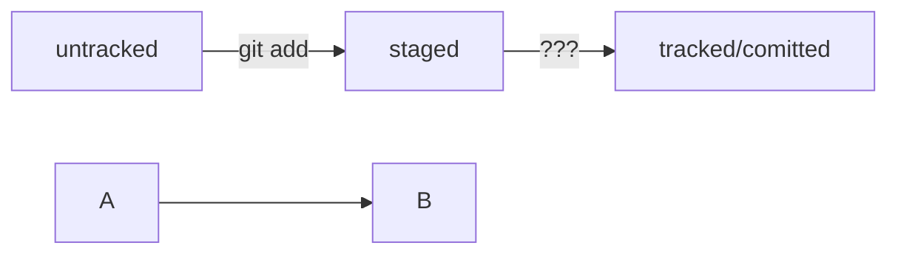

# Установка

Перейти на страницу официального сайта [Git](https://git-scm.com/download/win "Перейти на сайт загрузки").
Скачать одну из двух версий из категории Standalone Installer (англ. «автономный установщик»). Узнать тип системы Windows можно в настройках.
Запустить программу установки. Обратить внимание, куда будет установлен Git. По умолчанию C:\Program Files\Git.
Проверить, что в списке устанавливаемых программ стоит галочка напротив пункта Git Bash Here — это позволит открывать консоль с Git в любой папке.
Далее установщик предложит много опций. Достаточно оставить все настройки по умолчанию. Несколько раз нажать Next (англ. «далее»), пока не начнётся процесс установки.
После окончания установки нажать Finish (англ. «завершить»).

# Первый запуск Git Bash

Запустить программу Git Bash можно двумя способами: ввести название программы в окно поиска на панели задач или открыть директорию, в которую был установлен Git - по умолчанию C:\Program Files\Git\bin и запустить файл bash.exe.
Откроется консоль, в которой будет написано имя_пользователя@имя_компьютера, ниже $ |

# Комманды консоли

## Навигация

| Команда			| Назначение								|  Перевод					|
|-------------------|:------------------------------------------|:--------------------------|
|pwd 				| показать рабочую папку 					| print working directory	|
|ls 				| отобразить содержимое директории 			| list directory contents	|
|ls -a 				| отобразить также скрытые файлы и папки, 	|							|
|					|названия которых начинаются с символа . 	|							|
|cd project 		| сменить директорию / перейди в project 	| change directory			|
|cd project/html 	| перейди в папку html, которая находится в |							|
|					|папке project 								|							|
|cd .. 				| перейди выше, в родительскую папку		|							|
|cd ~ 				| перейди в домашнюю папку (/Users/Username)|							|
|cd / 				| перейди в корневую директорию.			|							|

## Работа с файлами и папками. Создание

| Команда			| Назначение								|  Перевод					|
|-------------------|:------------------------------------------|:--------------------------|
|touch index.html 	| создай файл index.html в текущей папке 	| touch - «коснуться») 		|
|mkdir project		| создать директорию/папку с именем project | make directory			|
|					|в текущей папке 							| make directory			|


>touch index.html style.css script.js - если нужно создать сразу несколько файлов, можно напечатать их имена в одну строку через пробел

## Копирование и перемещение

|Команда			| Назначение								|  Перевод					|
|-------------------|:------------------------------------------|:--------------------------|
|cp file.txt ~/dir	| копировать файл в другое место 			| copy						|
|mv file.txt ~/dir 	| перемести файл или папку в другое место 	| move						|

## Чтение

|Команда			| Назначение								|  Перевод					|
|-------------------|:------------------------------------------|:--------------------------|
|cat file.txt 		| объединить и распечатать содержимое 		|							|
|					|текстового файла file.txt 					| concatenate and print		|

## Удаление

|Команда			| Назначение								|  Перевод					|
|-------------------|:------------------------------------------|:--------------------------|
|rm about.html 		| удалить файл about.html 					| remove					|
|rmdir images  		| удалить директорию/папку images 			| remove directory			|
|rm -r project 		| удалить папку project и всё содержимое	| remove					|

### Полезные возможности

> Команды необязательно печатать и выполнять по очереди. Можно указать их списком — разделить двумя амперсандами (&&).
У консоли есть собственная память — буфер с несколькими последними командами. По ним можно перемещаться с помощью клавиш со стрелками вверх (↑) и вниз (↓).
Чтобы не вводить название файла или папки полностью, можно набрать первые символы имени и дважды нажать Tab. Если файл или папка есть в текущей директории, командная строка допишет путь сама.
Например, вы находитесь в папке dev. Начните вводить cd first и дважды нажмите Tab. Если папка first-project есть внутри dev, командная строка автоматически подставит её имя. Останется только нажать Enter.

git version - узнать версию установленной Git 
git config --global user.name "UserName" - имя или ник нужно написать латиницей и в кавычках 
git config --global user.email username@mail.com - здесь нужно указать свой настоящий email 
$ git config --global user.name "UserName" 
$ git config --global user.email "UserName@mail.com" 
cat ~/.gitconfig - Все глобальные настройки Git хранит в файле .gitconfig в домашней директории. Команда запишет в этот файл указанные имя и почту. Чтобы убедиться в этом, можно вызвать команду для чтения файлов. 
git config --list

Сделать папку репозиторием — git init 
Чтобы Git начал отслеживать изменения в проекте, папку с файлами этого проекта нужно сделать Git-репозиторием (от англ. repository — «хранилище»). Для этого следует переместиться в неё и ввести команду git init (от англ. initialize — «инициализировать»). 
cd ~/dev/first-project # перешли в нужную папку 
git init # создали репозиторий 

«Разгитить» папку, если что-то пошло не так, — rm -rf .git 
Если вы случайно сделали Git-репозиторием не ту папку, её можно «разгитить». Для этого нужно удалить скрытую подпапку .git. 
$ cd <папка с репозиторием> # перешли в папку 

$ rm -rf .git # удалили подпапку .git 
Проверить состояние репозитория — git status 
git status 
Подготовить файлы к сохранению — git add 
$ touch todo.txt 
$ touch readme.txt 
создали файлы todo.txt и readme.txt 

$ git status # проверили статус 
$ git add todo.txt 
$ git add readme.txt 
$ git add --all # подготовили к сохранению все файлы в репозитории 

Выполнить коммит — git commit 
Сделать коммит можно командой git commit c ключом -m (от англ. message — «сообщение»), который присваивает коммиту сообщение. 
git commit -m ‘Мой первый коммит!’ 

git commit -m ‘Мой первый коммит!’ 

Просмотреть историю коммитов — git log 

## Инструкция по регистрации на GitHub

В правом верхнем углу главной страницы [GitHub](https://github.com/ "Главная страница GitHub") нажмите на Sign up (англ. «зарегистрироваться»).

На экране будут последовательно появляться поля для ввода.
2.1. Введите адрес электронной почты (англ. Enter your email). 
2.2. Придумайте пароль (англ. Create a password). 
2.3. Введите имя пользователя (англ. Enter a username). 

Платформа спросит, хотите ли вы получать на почту рассылку с обновлениями и новостями (англ. Would you like to receive product updates and announcements via email?). Введите y, если хотите получать рассылку, или n, если не хотите.
Нажмите кнопку Continue (англ. «продолжить»).

GitHub предложит вам пройти капчу. Сделайте это.
После прохождения капчи нажмите Create account (англ. «создать аккаунт»).
Введите короткий код, который будет отправлен на указанный вами почтовый адрес.

Поздравляем! Вы успешно зарегистрировались на крупнейшем веб-хостинге проектов GitHub. Теперь у вас есть возможность работать бок о бок с миллионами профессионалов по всему миру, обмениваться идеями и развиваться. 

## Инструкция по созданию репозитория на GitHub

Зайдите в свой профиль по ссылке https://github.com/username, где username — имя, которое вы указали при регистрации.

Эта страница — презентация вас и ваших проектов. Её видят другие пользователи. Надпись You don't have any public repositories yet (англ. «у вас пока нет публичных репозиториев») сообщает, что пока у вас нет проектов.

Создайте репозиторий. Для этого перейдите на вкладку Repositories (англ. «репозитории»), а затем нажмите на зелёную кнопку New (англ. «новый») справа.

Открылось окно создания нового репозитория. Назовите его first-project. Название удалённого репозитория необязательно должно совпадать с именем папки проекта у вас на компьютере. Но чтобы не путаться, будем называть их одинаково.

Другие поля вам пока не понадобятся. Смело нажимайте на зелёную кнопку Create repository (англ. «создать репозиторий») внизу.

Готово! Удалённый репозиторий создан. Страница с ним открывается автоматически. 

Осталось связать удалённый репозиторий с локальным, который уже есть на вашем компьютере. GitHub предоставляет для этого инструкцию (пункт …or push an existing repository from the command line).
Но прежде, чтобы упростить работу с GitHub и сделать её более безопасной, вы научитесь генерировать SSH-ключи (от англ. Secure Shell — «безопасная оболочка»)

## Генерируем SSH-ключ

```
Представьте, что у вас есть ключ от двери, за которой хранится важный документ. Чтобы получить доступ к этому документу,
вам нужно вставить ключ в замочную скважину и повернуть его. Поскольку ключ есть только у вас, ваш документ надёжно защищён
от посторонних глаз. Чтобы получить доступ к репозиторию на GitHub, вам тоже нужно предоставить ключ, который подтверждает
вашу личность и права на чтение или изменение данных. Без этого ключа доступ будет ограничен. Об этом и пойдёт речь в уроке.
Что такое SSH
Когда компьютеры обмениваются данными в сети, они следуют сетевым протоколам (англ. network protocols) — правилам обмена
данными между компьютерами.
Один из наиболее распространённых сетевых протоколов — SSH (от англ. Secure Shell Protocol). Он обеспечивает безопасный обмен
данными в сети. С помощью этого протокола можно получать данные с удалённого компьютера или отправлять их на него. Трафик
шифруется, поэтому протокол безопасен.
SSH использует пару ключей для обеспечения безопасности — публичный и приватный: 
Приватный ключ (англ. private key) хранится только на вашем компьютере и не должен передаваться кому-либо ещё.
Он используется для расшифровки данных.
Публичный ключ (англ. public key) доступен всем и используется для шифрования данных.
Они могут быть расшифрованы парным приватным ключом.
Только вы можете расшифровать данные с помощью приватного ключа, но любой владелец публичного ключа может их для вас зашифровать.
Эти два ключа связаны и образуют SSH-пару. В будущем вы наверняка будете использовать их для взаимодействия с GitHub и другими
удалёнными серверами.
```

## Создание ключа шифрования SHH

Проверка наличия SSH-ключа
 cd ~ перейти в домашнюю директорию
 ls -la .ssh/ вывели список созданных ключей

## Инструкция по генерации SSH-ключа

Для генерации SSH-пары можно использовать программу ssh-keygen. Откройте терминал и введите следующую команду.
 ssh-keygen -t ed25519 -C "User@mail.com" - электронная почта, к которой привязан ваш аккаунт на GitHub" 
Generating public/private rsa key pair. - сгенерированы публичный и приватный ключи
Укажите место хранения ключей. Простой вариант — сделать домашний каталог пользователя путём по умолчанию. Для этого нажмите Enter.
Enter passphrase (empty for no passphrase): [Type a passphrase]
Enter same passphrase again: [Type passphrase again] 
Программа запросит кодовую фразу (англ. passphrase) для доступа к SSH-ключу. Вы можете оставить поле пустым. Для этого нажмите Enter, а затем ещё раз Enter для подтверждения.
Enter passphrase (empty for no passphrase):
Enter same passphrase again:
Your identification has been saved in /c/Users/UserName/.ssh/id_ed25519
Your public key has been saved in /c/Users/UserName/.ssh/id_ed25519.pub
The key fingerprint is:
SHA256:u+jW2SUszanEX/1BdH0cr0PDOQYSfCZ3F0CMW2+D6dM UserName@mail.com
The key's randomart image is:
+--[ED25519 256]--+
|         .o.=o.++|
|          oo+=.oB|
|           =o.%.+|
|           . = O |
|       .S+ ...* .|
|        +.* oo.E |
|       o.* +  ...|
|      ..+.o     .|
|     oo .        |
+----[SHA256]-----+

ls -a ~/.ssh 

## Инструкция по связыванию SSH-ключа и GitHub-аккаунта

В директории ~/.ssh будет создано два файла — id_ed25519 и id_ed25519.pub (или id_rsa и id_rsa.pub — в зависимости от выбранного алгоритма шифрования):
id_ed25519/id_rsa — приватный ключ (файл без .pub в конце). Ни в коем случае не копируйте его и не делитесь им.
id_ed25519.pub/id_rsa.pub — публичный ключ (на это указывает расширение .pub).
Скопируйте содержимое файла с публичным ключом в буфер обмена.

## для macOS
скопировать содержимое ключа в буфер обмена:
```
$ pbcopy < ~/.ssh/id_rsa.pub
для ed25519:
$ pbcopy < ~/.ssh/id_ed25519.pub 
Здесь используется команда pbcopy — она копирует поток данных в буфер обмена. 
Запись pbcopy < ~/.ssh/id_rsa.pub означает: «Скопируй в буфер обмена всё 
содержимое файла ~/.ssh/id_rsa.pub».
```
В качестве альтернативы вы можете распечатать файл на экран с помощью cat ~/.ssh/id_rsa.pub и скопировать его вручную.

## для Windows
скопировать содержимое ключа в буфер обмена:
```
$ clip < ~/.ssh/id_rsa.pub
для ed25519:
$ clip < ~/.ssh/id_ed25519.pub 
Если clip не сработает, выведите содержимое файла с помощью 
cat ~/.ssh/id_rsa.pub или cat ~/.ssh/id_ed25519.pub и 
скопируйте вывод в буфер обмена из консоли.
```
Перейдите на GitHub и выберите пункт Settings (англ. «настройки») в меню аккаунта.

В меню слева нажмите на пункт SSH and GPG keys.

В открывшейся вкладке выберите New SSH key (англ. «новый SSH-ключ»).

В поле Title (англ. «заголовок») напишите название ключа. Например, Personal key (англ. «личный ключ»).
В поле Key type (англ. «тип ключа») должно быть Authentication Key (англ. «ключ аутентификации»).
В поле Key скопируйте ваш ключ из буфера обмена.


8. Нажмите на кнопку Add SSH key (англ. «добавить SSH-ключ»).

Проверьте правильность ключа с помощью следующей команды.
$ ssh -T git@github.com 
Если это первый раз, когда вы используете Git, чтобы поделиться проектом на GitHub, появится похожее предупреждение.
The authenticity of host 'github.com (140.82.121.4)' can't be established. ED25519 key fingerprint is SHA256:+DiY3wvvV6TuJJhbpZisF/zLDA0zPMSvHdkr4UvCOqU. This key is not known by any other names. Are you sure you want to continue connecting (yes/no/[fingerprint])? 
Это предупреждение сообщает, что вы никогда не соединялись с сервером GitHub. Поэтому Git не может гарантировать, что сервер является тем, за кого он себя выдаёт.
Для подтверждения подлинности сервер генерирует и публикует ключи SHA256. Вы можете проверить ключи GitHub по этой ссылке. Если ключ в предупреждении совпадает с тем, что вы видите на сайте, значит, сервер является действительным. Введите yes, чтобы продолжить. Вы увидите приветствие на экране.
Hi %ВАШ_АККАУНТ%! You've successfully authenticated, but GitHub does not provide shell access. 
Если у вас возникли сложности при генерации или привязке SSH-ключей, посмотрите видеоинструкцию, в которой мы показываем всё по порядку.

## Привязать удалённый репозиторий к локальному — git remote add

Перейдите на страницу удалённого репозитория, выберите тип SSH и скопируйте URL. Кнопка справа позволит сделать это мгновенно.
git@github.com:UserName/project.git
git remote add origin git@github.com:UserName/project.git

В командную строку нельзя вставить текст из буфера обмена с помощью привычного сочетания Ctrl+V. На Windows (в Git Bash) и Linux для этого используется сочетание Ctrl+Shift+V, а на macOS — Cmd+V.
Также можно нажать правую кнопку мыши и выбрать пункт Paste (англ. «вставить») в выпадающем меню.
origin (англ. «источник») — стандартный псевдоним, с помощью которого можно обращаться к главному удалённому репозиторию (обычно такой репозиторий один). Это значительно упрощает работу.
Убедиться, что репозитории связаны, — git remote -v
git remote -v
origin git@github.com:UserName/project. (fetch)
origin git@github.com:UserName/project. (push)

В выводе вы должны увидеть две строчки, аналогичные тем, что показаны выше.
Флаг -v — короткая форма флага --verbose (англ. «подробный»). Он позволяет показать больше информации в выводе.

Отправить изменения на удалённый репозиторий — git push

В первый раз эту команду нужно вызвать с флагом -u и параметрами origin (имя удалённого репозитория) и main или master (название текущей ветки). Флаг -u свяжет локальную ветку с одноимённой удалённой. Как вы связывали локальный и удалённый репозитории в предыдущем уроке, так же и здесь нужно дополнительно связать ветки.

git config --list
$ git config --list
diff.astextplain.textconv=astextplain
filter.lfs.clean=git-lfs clean -- %f
filter.lfs.smudge=git-lfs smudge -- %f
filter.lfs.process=git-lfs filter-process
filter.lfs.required=true
http.sslbackend=openssl
http.sslcainfo=C:/Program Files/Git/mingw64/etc/ssl/certs/ca-bundle.crt
core.autocrlf=true
core.fscache=true
core.symlinks=false
pull.rebase=false
credential.helper=manager
credential.https://dev.azure.com.usehttppath=true
init.defaultbranch=master
user.name=UserName
user.email=UserName@mail.com
core.repositoryformatversion=0
core.filemode=false
core.bare=false
core.logallrefupdates=true
core.symlinks=false
core.ignorecase=true
remote.origin.url=git@github.com:UserName/project.git
remote.origin.fetch=+refs/heads/*:refs/remotes/origin/*

git push -u origin master

$ git push -u origin master
Enumerating objects: 14, done.
Counting objects: 100% (14/14), done.
Delta compression using up to 20 threads
Compressing objects: 100% (10/10), done.
Writing objects: 100% (14/14), 1.27 KiB | 1.27 MiB/s, done.
Total 14 (delta 1), reused 0 (delta 0), pack-reused 0
remote: Resolving deltas: 100% (1/1), done.
To github.com:UserName/project.git
 * [new branch]      master -> master
branch 'master' set up to track 'origin/master'.

В дальнейшем при работе с удалённым репозиторием флаг -u можно опустить и писать просто git push.

Преимущество README.md в том, что средства командной работы (такие, как GitHub) могут отображать его содержимое в браузере в виде удобной разметки. Для этого нужно не просто залить текст, но и настроить шрифт, заголовки и отступы с помощью markdown. Маркда́ун — это специальный язык разметки. Он позволяет красиво отформатировать текстовый документ.

# Шпаргалка markdown

## Выделение текста

Вы можете выделять текст в markdown с помощью символов `_` или `*`. Например:

Пример _курсива_ и **жирного** текста.

## Заголовки

Заголовки можно создавать с помощью символа `#`. Чем больше `#`, тем меньше заголовок. Например:

# Заголовок первого уровня
## Заголовок второго уровня
### Заголовок третьего уровня

## Выделение кода

Чтобы выделить текст как код, поместите его в тройные кавычки "`". 

```
mkdir my_project
cd my_project
git init
```

Это лишь некоторые функции markdown. 

## Ссылки

Чтобы сделать ссылкой часть текста, его заключают в квадратные скобки, а затем указывают нужный адрес 
в круглых скобках.
[Яндекс](https://www.yandex.ru) 
Также можно добавить ссылке тайтл (от англ title — «название», «заголовок»). Тайтл — это всплывающая 
подсказка, которая появляется при наведении мыши на ссылку. Тайтл нужно заключить в кавычки и указать 
внутри скобок после адреса. [Яндекс](https://www.yandex.ru "Я Yandex!") 


# Хеш — идентификатор коммита

Что такое хеш. Хеширование коммитов
Хеширование (от англ. hash, «рубить», «крошить», «мешанина») — это способ преобразовать набор данных и 
получить их «отпечаток» (англ. fingerprint).
Информация о коммите — это набор данных: когда был сделан коммит, содержимое файлов в репозитории на 
момент коммита и ссылка на предыдущий, или родительский (англ. parent), коммит.
Git хеширует (преобразует) информацию о коммите с помощью алгоритма SHA-1 (от англ. Secure Hash 
Algorithm — «безопасный алгоритм хеширования») и получает для каждого коммита свой уникальный хеш — 
результат хеширования.

Обычно хеш — это короткая (40 символов в случае SHA-1) строка, которая состоит из цифр 0—9 и латинских 
букв A—F (неважно, заглавных или строчных). Она обладает следующими важными свойствами:
если хеш получить дважды для одного и того же набора входных данных, то результат будет гарантированно 
одинаковый;
если хоть что-то в исходных данных поменяется (хотя бы один символ), то хеш тоже изменится (причём 
сильно).
Поэкспериментировать с SHA-1 можно на [сайте](https://emn178.github.io/online-tools/sha1.html) — 
попробуйте ввести в поле input (англ. «ввод») разные символы, слова или предложения и понаблюдайте, как
 меняется хеш в поле output (англ. «вывод»).

Хеш — основной идентификатор коммита
Git хранит таблицу соответствий хеш → информация о коммите. Если вы знаете хеш, вы можете узнать всё 
остальное: автора и дату коммита и содержимое закоммиченных файлов. Можно сказать, что хеш — основной 
идентификатор коммита.
При работе с Git хеши будут встречаться регулярно. Их можно будет передавать в качестве параметра 
разным Git-командам, чтобы указать, с каким коммитом нужно произвести то или иное действие.
Все хеши и таблицу хеш → информация о коммите Git сохраняет в служебные файлы. Они находятся в скрытой 
папке .git в репозитории проекта.

# Лог

Лог (от англ. log — «журнал записей»). Сокращённый лог полезен, если нужно быстро найти нужный коммит 
среди сотни других.
git log

Элементы описания коммита
После вызова git log появляется список коммитов.

строка из цифр и латинских букв после слова commit — это хеш коммита;
Author — имя автора и его электронная почта;
Date — дата и время создания коммита;
в конце находится сообщение коммита.

Получить сокращённый лог — git log --oneline
Получить сокращённый лог можно с помощью команды git log с флагом --oneline (англ. «одной строкой»). В 
терминале появятся только первые несколько символов хеша каждого коммита и их комментарии.

Сокращённый лог полезен, если в репозитории уже много коммитов — например, сотни или тысячи. В этом 
случае можно быстро найти нужный по описанию.
Сокращённый хеш (то есть первые несколько символов полного) можно использовать точно так же, как и 
полный. Для этого команда git log --oneline автоматически подбирает такую длину сокращённых хешей, 
чтобы они были уникальными в пределах репозитория и Git всегда мог понять, о каком коммите идёт речь.

```
Обратите внимание: если выход из просмотра логов не произошёл автоматически, нажмите клавишу Q (от 
англ. Quit — «выйти») в английской раскладке клавиатуры.
```

# HEAD — всему голова

При вызове команды git log вы также могли заметить надпись (HEAD -> master) после хеша одного из 
коммитов. В этом уроке расскажем, что она означает.

Файл HEAD
Файл HEAD (англ. «голова», «головной») — один из служебных файлов папки .git. Он указывает на коммит, 
который сделан последним (то есть на самый новый).
В этом можно убедиться с помощью терминала. Перейдите в папку .git командой cd. Посмотрите содержимое 
файла HEAD командой cat.

```bash
$ pwd # посмотрели, где мы
/Users/user/dev/first-project

$ cd .git/
$ ls # посмотрели, какие есть файлы
COMMIT_EDITMSG  ORIG_HEAD  description  index  logs/     refs/
HEAD            config     hooks/       info/  objects/

$ cat HEAD # команда cat показывает содержимое файла
ref: refs/heads/master # в файле вот такая ссылка 
Внутри HEAD — ссылка на служебный файл: refs/heads/master (или refs/heads/main в зависимости от 
названия ветки). Если заглянуть в этот файл, можно увидеть хеш последнего коммита.
$ cat refs/heads/master # взяли ссылку из файла HEAD

внутри хеш
e007f5035f113f9abca78fe2149c593959da5eb7

$ git log 
сверяем с хешем последнего коммита
commit e007f5035f113f9abca78fe2149c593959da5eb7
Author: John Doe <johndoe@example.com>
Date:   Tue Mar 28 00:26:53 2023 +0300

    Добавить амбиций в список дел
```
... # другие коммиты 
Когда вы делаете коммит, Git обновляет refs/heads/master — записывает в него хеш последнего коммита. 
Получается, что HEAD тоже обновляется, так как ссылается на refs/heads/master.
При работе с Git указатель HEAD используется довольно часто. Мы уже упоминали, что многие команды Git 
принимают в качестве параметра хеш коммита. Если нужно передать последний коммит, то вместо его хеша 
можно просто написать слово HEAD — Git поймёт, что вы имели в виду последний коммит.

# Статусы файлов в Git

До появления Git системы контроля версий выделяли только два статуса у файлов: «уже закоммичен» и «ещё 
не закоммичен». Например, в Subversion (самой популярной VCS до эпохи Git) не нужно было выполнять 
команду — аналог git add, а можно было просто сделать коммит (svn commit). Эта команда по умолчанию 
добавляла в коммит все новые и изменённые файлы.

Такое поведение интуитивно более понятно. Зато Git даёт больше контроля за состоянием файлов. Хотя 
сначала это может показаться сложным, со временем вы оцените удобство более явного подхода.

Разберём подробнее, в каких состояниях (или статусах) могут находиться файлы в репозитории. А ещё 
проследим типичный жизненный цикл файла в Git.

## Статусы untracked/tracked, staged и modified

Одна из ключевых задач Git — отслеживать изменения файлов в репозитории. Для этого каждый файл 
помечается каким-либо статусом. Рассмотрим основные.

### untracked (англ. «неотслеживаемый»)

Мы говорили, что новые файлы в Git-репозитории помечаются как untracked, то есть неотслеживаемые. Git 
«видит», что такой файл существует, но не следит за изменениями в нём. У untracked-файла нет предыдущих
версий, зафиксированных в коммитах или через команду git add.

### staged (англ. «подготовленный»)
  
После выполнения команды git add файл попадает в staging area (от англ. stage — «сцена», «этап 
[процесса]» и area — «область»), то есть в список файлов, которые войдут в коммит. В этот момент файл 
находится в состоянии staged.

В одном из предыдущих уроков мы сравнили коммит с фотографией. Можно развить эту аналогию и сказать, 
что команда git add добавляет персонажей (текущее содержимое файла или нескольких файлов) на сцену 
(англ. stage) для общей фотографии, а git commit делает снимок всей сцены целиком. 

```
Staging area, index и cache

Staging area также называют index (англ. «каталог») или cache (англ. «кеш»), а состояние файла staged 
иногда называют indexed или cached.
Все три варианта могут встречаться в документации и в качестве флагов команд Git. А также в интернете 
— например, в вопросах и ответах на сайте Stack Overflow.
```

### tracked (англ. «отслеживаемый»)

Состояние tracked — это противоположность untracked. Оно довольно широкое по смыслу: в него попадают 
файлы, которые уже были зафиксированы с помощью git commit, а также файлы, которые были добавлены в 
staging area командой git add. То есть все файлы, в которых Git так или иначе отслеживает изменения.

### modified (англ. «изменённый»)

Состояние modified означает, что Git сравнил содержимое файла с последней сохранённой версией и нашёл 
отличия. Например, файл был закоммичен и после этого изменён.

```
Для файлов в состояниях staged и modified обычно не указывают, что они также tracked, потому что это состояние подразумевается.
```

## Про staged и modified

Команда git add добавляет в staging area только текущее содержимое файла. Если вы, например, сделаете 
git add file.txt, а затем измените file.txt, то новое содержимое файла не будет находиться в staging.
Git сообщит об этом с помощью статуса modified: файл изменён относительно той версии, которая уже в 
staging. Чтобы добавить в staging последнюю версию, нужно выполнить git add file.txt ещё раз.

## Типичный жизненный цикл файла в Git

Может показаться, что файлы в репозитории попадают в разные состояния хаотично. На практике это не так, и у большинства файлов вполне предсказуемый путь.


1. Файл только что создали. Git ещё не отслеживает содержимое этого файла. Состояние: untracked.
2. Файл добавили в staging area с помощью git add. Состояние: staged (+ tracked).
2.1. Возможно, изменили файл ещё раз. Состояния: staged, modified (+ tracked).
2.2. Обратите внимание: staged и modified у одного файла, но у разных его версий.
2.3. Ещё раз выполнили git add. Состояние: staged (+ tracked).
3. Сделали коммит с помощью git commit. Состояние: tracked.
4. Изменили файл. Состояние: modified (+ tracked).
5. Снова добавили в staging area с помощью git add. Состояния: staged (+ tracked).
6. Сделали коммит. Состояния: tracked.
Повторили пункты 4−7 много-много раз.

Выглядит довольно запутанно! Но на практике разобраться с этим будет проще, чем кажется.

# Как читать git status

Частая ошибка при использовании Git — закоммитить лишнее или, наоборот, забыть добавить важный файл в 
коммит. Этого легко избежать, если не забывать проверять статусы файлов с помощью команды git status. 
Как читать её вывод, покажем в этом уроке.

## Какие состояния показывает git status

Большинство файлов в типичном проекте будут находиться в состоянии tracked (то есть закоммичены и не 
изменены после коммита). Вы не увидите это состояние в выводе команды git status — иначе она бы каждый 
раз выводила список вообще всех файлов проекта.

В итоге git status показывает только следующие состояния файлов:
 - staged (Changes to be committed в выводе git status);
 - modified (Changes not staged for commit);
 - untracked (Untracked files).
 


## Подготавливаем репозиторий

Чтобы попрактиковаться, инициализируйте новый репозиторий ~/dev/git-status-lesson. Создайте в нём файл README.md и закоммитьте его.

```bash
$ cd ~/dev
$ mkdir git-status-lesson
$ cd git-status-lesson
$ git init
# тут Git выведет что-нибудь, но мы это пропустим
$ touch README.md
$ git add README.md
$ git commit -m 'Добавить README'
~~~~# по традиции первым создадим и закоммитим файл README.md 
```
Дальше вы будете добавлять в репозиторий файлы и смотреть на их статусы.

## Типичные варианты вывода git status

Рассмотрим четыре примера состояний, в которых может находиться ваш репозиторий.

1. Нет ни staged-, ни modified-, ни untracked-файлов.
Если ничего не менять в git-status-lesson после первого коммита, то в нём не должно быть ни изменённых 
файлов (modified), ни новых (untracked), ни добавленных в список на коммит (staged). Вызовите команду 
git status. Её вывод будет примерно таким.

```bash
$ git status
On branch master
nothing to commit, working tree clean
```
  
Это означает, что в репозитории нет новых или изменённых файлов. Последняя строка nothing to commit, 
working tree clean буквально переводится как «нечего коммитить, рабочая директория чиста».
Первая строка On branch master сообщает, что текущая ветка — master.

2. Найдены неотслеживаемые файлы.
Создайте в папке ~/dev/git-status-lesson файл fileA.txt. Теперь в репозитории есть новый файл в 
состоянии untracked. Снова вызовите команду git status. Результат будет таким.

```bash
$ touch fileA.txt
$ git status
On branch master
Untracked files: # найдены неотслеживаемые файлы
  (use "git add <file>..." to include in what will be committed)
        fileA.txt

nothing added to commit but untracked files present (use "git add" to track) 
```

Файл fileA.txt отображается в секции неотслеживаемых файлов — Untracked files. Это значит, что он не 
был добавлен в репозиторий через git add.

```
Обратите внимание: в самом выводе git status есть подсказка, какую команду использовать, чтобы добавить файл в список на коммит: Use git add <file> to include in what will be committed (англ. «используйте git add <file>, чтобы добавить в список на коммит»).
```

Добавьте fileA.txt в staging area с помощью git add и снова запросите git status.

```bash
$ git add fileA.txt 
$ git status
On branch master
Changes to be committed: # новая секция
  (use "git restore --staged <file>..." to unstage)
        new file:   fileA.txt
```
		
```
В этот раз git status подсказывает, что существует команда git restore. Мы познакомим вас с ней в одном из будущих уроков.
```

Теперь fileA.txt находится в секции Changes to be committed (англ. «изменения, которые попадут в 
коммит»). Если сейчас выполнить коммит, то в репозитории будет зафиксирована текущая версия этого 
файла. Закоммитьте его.

```bash
$ git commit -m 'Добавить файл fileA.txt'
# тут будет вывод комманды commit, он нас не интересует
$ git status
On branch master
nothing to commit, working tree clean 
```

Вывод команды git status такой же, какой был после первого коммита: «Директория чиста».

3. Найдены изменения, которые не войдут в коммит

Теперь откройте файл fileA.txt и добавьте в него несколько слов — например, Это файл A!. Сохраните 
fileA.txt и вызовите команду git status. Её результат будет такой.

```bash
# внесли в fileA.txt правки
# запросили статус
$ git status 
On branch master
Changes not staged for commit: # ещё одна секция
  (use "git add <file>..." to update what will be committed)
  (use "git restore <file>..." to discard changes in working directory)
        modified:   fileA.txt
```
		
Файл fileA.txt был изменён, но ещё не добавлен в staging area после этого. Так он оказался в секции 
Changes not staged for commit (англ. «изменения, которые не подготовлены к коммиту»). Эта секция 
соответствует статусу modified.

Подготовьте правки к коммиту с помощью git add.

```bash
$ git add fileA.txt
$ git status
On branch master
Changes to be committed: # все изменения готовы к коммиту
  (use "git restore --staged <file>..." to unstage)
        modified:   fileA.txt
```
		
Теперь в коммит попадёт уже новая версия файла fileA.txt.

```
Обратите внимание: хотя вывод команды git status очень похож на тот, который был после первого 
добавления файла fileA.txt, они всё же отличаются.
Когда совсем новый файл попадает в staging area, перед его названием указывается new file. Вот так: 
new file: fileA.txt.
Если файл уже однажды попадал в историю (с помощью коммита) и был изменён, после выполнения git add он 
будет записан уже так: modified: fileA.txt.
```

4. Файл добавлен в staging area, но после этого изменён

Вы добавили файл в staging area, но перед самым коммитом вспомнили важную мелочь. Например, вместо 
одного восклицательного знака в конце строки Это файл A! нужно поставить три.
Откройте текстовый редактор и добавьте нужные правки. Теперь можно выполнить коммит, но в любой 
непонятной ситуации сначала стоит вызвать git status. Он покажет следующее.

```bash
# изменили fileA.txt
$ git status
On branch master
Changes to be committed:
  (use "git restore --staged <file>..." to unstage)
          modified:   fileA.txt

Changes not staged for commit:
  (use "git add <file>..." to update what will be committed)
  (use "git restore <file>..." to discard changes in working directory)
          modified:   fileA.txt 
```

Файл попал и в staged (Changes to be committed), и в modified (Changes not staged for commit). В 
staging area находится версия файла с одним восклицательным знаком, а в Changes not staged for commit —
 уже изменённая версия, с тремя.
Чтобы закоммитить самую свежую версию файла, нужно снова выполнить git add перед коммитом

# Оформление сообщений к коммитам
То, как написаны сообщения коммитов, тоже может подчиняться определённым правилам. Иногда эти правила 
продиктованы культурой команды, а иногда техническими ограничениями.
Например, в выводе команды git log --oneline умещается максимум 
72 первых символа сообщения, поэтому многие правила включают пункт: «Сообщение не должно быть длиннее 
72 символов».

В этом уроке рассмотрим несколько популярных подходов к оформлению сообщений коммитов. Но сначала 
разберём, почему такие сообщения важны и зачем соблюдать правила их оформления.

## Зачем вообще писать сообщения

У каждого коммита в Git есть сообщение — то, что передаётся после параметра -m. Например: git commit -m
 "Добавить урок про оформление сообщений коммитов".
Сообщения коммитов можно сравнить с надписями на коробках в кладовке. Если надписей нет, то нужную 
коробку будет сложно найти: придётся заглянуть в каждую, чтобы понять, что там. А если надписи есть, то
 нужная найдётся сразу.
Как и надпись на коробке, сообщение коммита должно помочь определить, что внутри. Например, надпись на 
коробке «всякое разное» не очень полезная. Сообщение коммита «небольшие исправления» тоже: непонятно, 
что было исправлено в таком коммите и зачем.

Есть общие рекомендации по тому, как правильно составить сообщение. Оно должно быть:
1. относительно коротким, чтобы его было легко прочитать;
2. информативным.

Вот пример полезного сообщения в репозитории новостного сайта: Исправление опечатки в заголовке главной
 страницы на хорватском. Такое сообщение даёт много информации:
1. Исправление опечатки значит, что исправлена ошибка, которая была допущена при наборе. Такое 
исправление не меняет смысл. То есть, например, главному редактору не нужно перепроверять этот 
заголовок.
2. На хорватском говорит о том, что переводчикам на другие языки этот коммит можно смело пропускать.
3. В заголовке главной страницы указывает, где произошли изменения. Если, например, кто-то зайдёт на 
сайт и ему не понравится новый заголовок, он легко найдёт по истории (git log) автора этого коммита и 
спросит у него, почему заголовок теперь такой.

Пример плохого сообщения для того же коммита: Исправлена опечатка. Это сообщение даёт мало информации. 
В такой коммит придётся «заглядывать» — разбираться, что именно поменялось и зачем.

## Стили оформления

Все люди разные и у всех есть предпочтения — в том числе, как формулировать сообщения коммитов. Кто-то 
использует инфинитивы: Исправить сообщение об ошибке E123, кто-то — глаголы в прошедшем времени: 
Исправил…, кто-то — существительные: Исправление….

Без единообразия коммитов нет и эффективной работы в Git. Это может показаться мелочью, но когда 
коммиты с сообщениями в разных стилях идут друг за другом, их может быть сложно читать.

Чтобы упростить работу, команды или даже целые компании часто договариваются об определённом стиле (то 
есть о правилах) оформления сообщений коммитов.

Например, правила могут быть такие:
1. длина сообщения от 30 до 72 символов;
2. первое слово — глагол в инфинитиве («исправить», «дополнить», «добавить» и другие);
3. и так далее.

Есть много подходов к оформлению сообщений коммитов, но мы расскажем о нескольких популярных. Их 
используют как отдельные команды, так и целые проекты.

## Корпоративный

Во многих компаниях применяется Jira — система для организации проектов и задач. У каждой задачи в Jira
 есть идентификатор из нескольких заглавных латинских букв и номера. Например, LGS-239 значит, что это 
239-я задача в проекте LGS (сокращение от англ. logistics — «логистика»).
В корпоративном стиле в начале сообщения обычно указывают Jira-ID, а после — текст сообщения.
```
$ git commit -m "LGS-239: Дополнить список пасхалок новыми числами"
``` 
Какие-то команды могут договариваться, с какой части речи начинать сообщение и какой длины оно должно 
быть, какие-то — нет. Но требование о наличии Jira-ID обычно строгое: оно позволяет автоматически 
связывать коммиты с задачами и проектами.

## Conventional Commits

Стандарт Conventional Commits (англ. «соглашение о коммитах») отличается качественной документацией и 
подробной проработкой. Он подходит для репозиториев с исходным кодом программ. Использовать его для 
других типов проектов (например, для перевода книги) было бы неудобно.

Conventional Commits предлагает такой формат коммита: <type>: <сообщение>. Первая часть type — это тип 
изменений. Таких типов достаточно много. Вот два примера:

1. feat (сокращение от англ. feature) — для новой функциональности;
2. fix (от англ. «исправить», «устранить») — для исправленных ошибок.

Более подробный список можно увидеть на [сайте](https://www.conventionalcommits.org/ru/v1.0.0-beta.4/#%D1%81%D0%BF%D0%B5%D1%86%D0%B8%D1%84%D0%B8%D0%BA%D0%B0%D1%86%D0%B8%D1%8F) с описанием этого стиля.
Например, сообщение может быть таким.

```bash
git commit -m "feat: добавить подсчёт суммы заказов за неделю" 

```

## GitHub-стиль
GitHub можно использовать не только для хранения файлов проекта, но и для ведения списка задач (англ. 
issue) этого проекта. Если коммит «закрывает» или «решает» какую-то задачу, то в его сообщении удобно 
указывать ссылку на неё. Для этого в любом месте сообщения нужно указать #<номер задачи>. Например, вот
 так.

```bash
$ git commit -m "Исправить #334, добавить график температуры" 
```

В таком случае GitHub свяжет коммит и задачу.

```
 Инфинитив и императив
Для сообщений на русском языке часто рекомендуют использовать инфинитивы. Например: Добавить тесты для PipkaService, Исправить ошибку #123 и так далее.
Для сообщений на английском рекомендуется использовать повелительное наклонение (англ. imperative). Например: Use library mega_lib_300, Fix exit button и так далее.
Эти рекомендации сложились исторически, и им следуют многие проекты.
```
